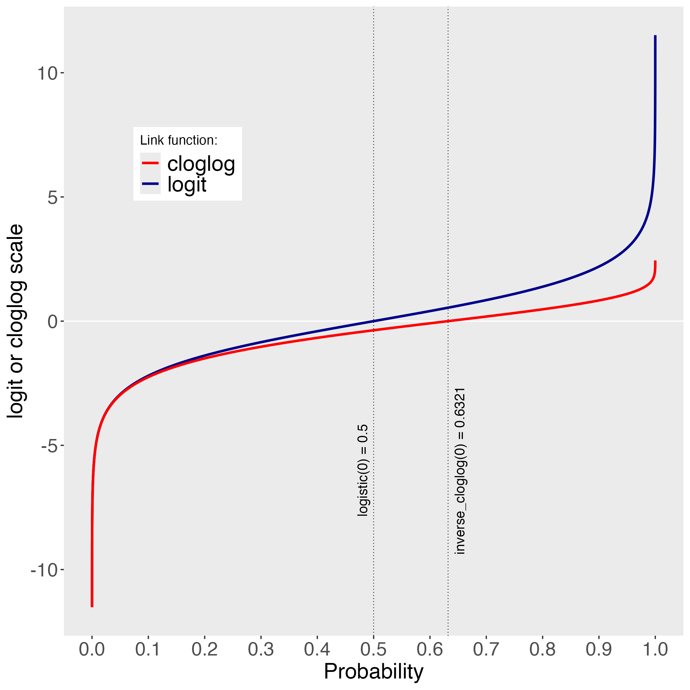

```{r setup, include = FALSE}
pkg <- c("papaja", "citr", "tidyverse", "RColorBrewer", "patchwork")

lapply(pkg, library, character.only = TRUE)
```

```{r analysis-preferences}
# Seed for random number generation
set.seed(42)
knitr::opts_chunk$set(cache.extra = knitr::rand_seed)
```

```{r plot-settings}
## theme settings for ggplot
theme_set(
  theme_bw() +
    theme(text = element_text(size = 18, face = "bold"), 
          title = element_text(size = 18, face = "bold"),
          legend.position = "bottom")
)

## Set the amount of dodge in figures
pd <- position_dodge(0.7)
pd2 <- position_dodge(1)
```

```{r global-chunk-settings}
## set the figure options
knitr::opts_chunk$set(fig.pos='H', out.extra = '', out.height = "67%",
                      fig.align = "center") # initial version
```

<!-- the below two lines directly change the default Figure and Table naming to Supplementary -->

<!-- see here for more details - https://stackoverflow.com/questions/47173279/internationalization-r-knitr-figure-caption-label -->

\renewcommand{\figurename}{Supplementary Figure}
\renewcommand{\tablename}{Supplemetentary Table}

# Supplemental Material


## A. EHA concepts in the context of RT tasks

### Observation period, follow-up period, and risk episodes

To collect observations on the continuous variable RT, experimental psychologists typically administer a set of discrete, planned observations, a.k.a. trials, to each participant, and manipulate some aspect of the environment between trials. In Supplementary Figure 1, we present a hypothetical single-subject RT data set from a detection experiment with one response button (i.e., a simple RT task) and two experimental conditions: target present and target absent. For example, each trial in each condition might start with a fixation screen for 1 s, a target display screen for 100 ms in which the target stimulus is presented or not depending on the experimental condition the trials belongs to, and finally a blank screen until an overt response is detected or 500 ms have passed. Figure 1A shows that the participant presses the button sometime before 500 ms in most trials in the target-present condition (black dots), while (s)he does not press the button in most trials of the target-absent condition (black crosses). In EHA parlance, the single event of interest is a button press response that is repeatedly measured, *time zero* is defined as target display onset, the  *follow-up period* is 500 ms long in each trial, starting at time onset (i.e., time zero) in each trial the participant is *at risk* for response occurrence as long as the response has not occurred yet (or the response deadline is not reached yet), and the individual starts in an "idle" state in each trial and *transitions* to a "detected" state when a response occurs.

(ref:descr-fig1-caption) Response time (RT) tasks and EHA concepts. The timer starts at time 0 (black vertical line) and stops at the censoring time (dotted vertical line). In each trial of each condition of each task, an overt response is indicated by a circle, a right-censored observation by a cross, and a risk episode by a horizontal black line. (A) Single-button detection data requires a single-event analysis. (B) Two-button discrimination data requires a competing risks analysis. Black (white) dots indicate correct (error) responses. (C) Competing risk data in combination with an stimulus-onset-asynchrony manipulation might require increasing the follow-up period in each trial. (D) Two-button bistable perception data requires a recurrent event / multistate analysis. Black bars indicate stimulus presentation.


```{r plot1-revision2-test, fig.cap = "(ref:descr-fig1-caption)", out.width="90%"}
knitr::include_graphics("../../REVIEW2/Plot_RTtasks.png")
```

Recurrent events are events that happen repeatedly within the same follow-up period. For example, Figure 1D shows hypothetical data from a bistable perception task in which the participant is looking at an ambiguous stimulus (e.g., the duck-rabbit illusion, the Necker cube) for two minutes in each trial, and asked to press a button each time when her/his perception switches from one possible interpretation to the other possible interpretation. In this task, there are two events (percept A switches to percept B, percept B switches to percept A) that can recur within the same observation period of two minutes, so that the individual transitions back and forth between two states. 

Thus, each individual contributes multiple, sequential episodes within the follow-up period in each trial.

We do not analyse recurrent events in this tutorial. More information about recurrent events and multistate analysis can be found in @stoolmillerModelingHeterogeneitySocial2006, @millsIntroducingSurvivalEvent2011, and @lougheedMultilevelSurvivalAnalysis2019.


For example, if the censoring time was 1 second, then some trials result in observed event times (those with a RT below 1 second), while the other trials result in response times that are right-censored at 1 second.

### Right-censoring versus random censoring


Right-censoring occurs when we only know that the event time is larger than some value, i.e., the censoring time. The most common type of right-censoring is “singly Type I censoring” which applies when the experiment uses a fixed response deadline for all trials. “Type I” means that the censoring time is fixed and under the control of the experimenter; “Singly” refers to the fact that all observations have the same censoring time [@allisonSurvivalAnalysisUsing2010]. 

(ref:descr-plot-RT-tasks-caption) 

```{r plot-RT-tasks, fig.cap = "(ref:descr-plot-RT-tasks-caption)", out.width="80%"}
knitr::include_graphics("../../manuscript/Suppl_material/Plot_paradigms.png")
```

Importantly, when estimating the shape of the RT distribution in each experimental condition, EHA takes into account right-censored observations. As a result, EHA has a wider scope than current methods, as it can also be applied to RT data from experimental paradigms in which RTs are typically not measured, such as masking experiments and studies on the attentional blink. Also, EHA allows to increase experimental design efficiency, because we can introduce a response deadline instead of waiting until a response is emitted in each trial, so that we do not have to wait for very slow responses which would be trimmed anyway.

Right censoring is a type of missing data problem and a nearly universal feature of survival data including RT data [@allisonSurvivalAnalysisUsing2010]. For example, all trials in Supplementary Figure 1A have a censoring time of 500 ms, and some trials result in observed event times (those with a RT below 500 ms), while other trials result in response times that are right-censored at 500 ms. Clearly, discarding right-censored observations before calculating the median or mean RT will result in biased estimates, especially in the target-absent condition. The fact that EHA can deal with right censoring presents a analytical strength of the approach compared to many common approaches in experimental psychology (e.g., ANOVA, linear regression, delta plots).

Left censoring occurs when all that is known about an observation on a variable T is that it is less than some value. Interval censoring combines right and left censoring so that all you know about RT is that a < RT < b, for some values of a and b. *Random censoring* occurs when observations are terminated for reasons that are not under the control of the experimenter. 


### Competing risks

When there are multiple events of interest, such as death from accident vs. natural causes, or correct versus error responses, there is a *competing risks* situation. For example, Figure 1B displays a hypothetical single-subject RT data set from a discrimination experiment with two response buttons and two experimental conditions: A and B. Each trial in each condition might start, for example, with a fixation screen for 1 s, followed by a target display screen for 100 ms in which a female or male face is presented, and finally a blank screen until an overt response is detected or 800 ms have passed since face onset. Participants are required to press the left button when identifying a male, and the right button when identifying a female. 

There are two ways to deal with a competing-risks situation. One approach is to describe and model *cause-specific hazard functions*: the hazard function of correct response occurrence while treating incorrect responses as right-censored observations, and vice versa. When estimating the hazard of correct response occurrence, then the unpredictable error responses will introduce random censoring (and vice versa). Importantly, all statistical methods for time-to-event data require that random censoring be noninformative: a trial that is censored at time c should be representative of all those trials with the same values of the explanatory variables that survive to c [@allisonSurvivalAnalysisUsing2010]. However, the random censoring due to error responses when estimating the hazard function of correct responses (and vice versa) is very likely informative, because response channels are known to compete with one another [@BURLE2004153; @praamstra9513; @eriksenElectromyographicExaminationResponse1985]. Therefore, another approach is to model the hazard of (any) response occurrence and extend it with a speed-accuracy trade-off (SAT) analysis (plotting accuracy as a function of latency). This is the approach taken here. See also section B.

### When to start the timer?

The timer is started at time zero, which typically is defined as imperative stimulus onset. However, sometimes we want to start the time at trial onset. For example, a target stimulus can be presented with a certain SOA in relation to another stimulus (e.g., prime, mask, distractor, cue). In such cases, the mean RT will always conceal the possibe presence of responses triggered by the non-target stimulus [@panisHowCanWe2020; @panisWhatShapingRT2016]. To illustrate this, in Supplementary Figure 1C a prime is presented before a target with a SOA of -400 ms (see upper x-axis labels). To capture responses triggered by the prime (and emitted before target onset) we have to start the timer at trial (or prime) onset. Thus, when RTs are recorded relative to target onset by the stimulus presentation software, we have to add a constant time to each RT datum (here: + 400 ms) in order to include these prime-triggered "negative" RTs in the analysis (see lower x-axis labels). In general, all RTs must be positive for EHA to work.

## B. Describing the shape of a distribution of time-to-event data


The conditional accuracy function or ca(t) = Prob(correct | RT = t) gives you for each time bin the conditional probability that a response is correct given that it is emitted in time bin t [@kantowitzInterpretationReactionTime2021; @wickelgrenSpeedaccuracyTradeoffInformation1977; @allisonSurvivalAnalysisUsing2010]. 
The conditional accuracy function is also known as the micro-level speed-accuracy tradeoff (SAT) function (see examples in Figure 5).
We refer to the extended (hazard + conditional accuracy) analysis for choice RT data as EHA/SAT. 


Because our Tutorials focus on discrete-time methods as explained in section 2.3, we assume now that 

Suppose that the continuous-time RTs have been discretized by partioning the risk episode in each trial into contiguous bins of 20 ms, indexed by t (= 1, 2, ...). In other words, suppose we apply interval censoring to the continous-time RT data using intervals of 20 ms. As shown in Supplementary Figure 2, the resulting distribution of interval-censored event times can be described in various ways, the first two of which are highly familiar to cognitive scientists.

* the probability mass function

The probability mass function or P(t) = Prob(RT = t) is what you get when you plot a simple histogram of the relative frequencies. In other words, time is partitioned in a set of time periods or bins with a certain width (here: 20 ms), one counts the number of observed RTs in each time bin, and then divide this count by M, the total number of trials for the respective condition. P(t) displays for each bin the probability that the response occurs in bin t.

* the cumulative distribution function

The discrete-time cumulative distribution function or F(t) = Prob(RT <= t) displays for each bin the probability that the response occurs in bin t or in earlier bins. It always starts at 0 and increases towards 1.
 
* the survivor function

The discrete-time survivor function or S(t) = Prob(RT > t) is the complement of F(t), and displays for each bin the probability that the response occurs after bin t. It always starts at 1 and decreases towards 0.

* the discrete-time hazard function

The discrete-time hazard function or h(t) = Prob(RT = t | RT >= t) displays for each bin the *conditional* probability that the response occurs in bin t given that the response does not occur in earlier bins (t-1, t-2, ..., t=1). It is also known as the conditional probability mass function because h(t) = P(t)/S(t-1). In other words, h(t) estimates the risk of event occurrence in bin t given one is still waiting for a response at the start of bin t. More generally, it represents the conditional probability that a behavioral response is about to occur given that the psychological decision-making process has not finished yet.

EHA focuses on describing and modeling the hazard function of event occurrence because (a) it is uniquely sensitive to the amount of waiting time that has passed for each time bin, (b) and highly diagnostic for describing the shape of waiting time distributions as it also describes differences in the right tail (see Figure 2).

(ref:descr-fig2-caption) In discrete time, the shape of a RT distribution can be described using the probability mass function (A), the cumulative distribution function (B), the survivor function (C), and the discrete-time hazard function (D). Samples are drawns from three example distributions (two normal and one exgaussian distribution). Note the small differences in P(t), F(t), and S(t) and the relatively large difference in both hazard estimates around 800 ms. Sample-based hazard will hit 1 in the bin with the largest observed response time when none of the observations are right-censored. Also, there is always increased uncertainty around hazard estimates in later time bins.

```{r plot2-revision2-test2, fig.cap = "(ref:descr-fig2-caption)", out.width="90%"}
knitr::include_graphics("../../REVIEW2/Plot_distributions.png")
```

The shape of a distribution of waiting times can be described in multiple ways [@luceResponseTimesTheir1991]. After dividing time in discrete, contiguous time bins indexed by t, let RT be a discrete random variable denoting the rank of the time bin in which a particular person's response occurs in a particular trial. 
Because waiting times can only increase, discrete-time EHA focuses on the discrete-time hazard function 

\noindent h(t) = P(RT = t| RT $\geq$ t)   \hfill  (1)

\noindent and the discrete-time survivor function 

\noindent S(t) = P(RT $>$ t) = [1-h(t)].[1-h(t-1)].[1-h(t-2)]...[1-h(1)]  \hfill  (2)

\noindent and not on the probability mass function 

\noindent P(t) = P(RT = t) = h(t).S(t-1)  \hfill  (3)

\noindent nor the cumulative distribution function 

\noindent F(t) = P(RT $\leq$ t) = 1-S(t)   \hfill  (4)  

The discrete-time hazard function of event occurrence gives you for each bin the conditional probability that the event occurs (sometime) in that bin, given that the event has not occurred yet in previous bins. This conditionality in the definition of hazard is what makes the hazard function so diagnostic for studying event occurrence, as an event can physically not occur when it has already occurred before. 

While the discrete-time hazard function assesses the unique risk of event occurrence associated with each time bin, the discrete-time survivor function cumulates the bin-by-bin risks of event *non*occurrence to obtain the probability that the event does not occur before the upper bound of bin t. 

The probability mass function cumulates the risk of event occurrence in bin t with the risks of event nonoccurrence in bins 1 to t-1. From equation 3 we find that hazard in bin t is equal to P(t)/S(t-1). 

The survivor function provides a context for the hazard function, as S(t-1) = P(RT > t-1) = P(RT $\geq$ t) tells you on how many percent of the trials the estimate h(t) = P(RT = t| RT $\geq$ t) is based. The probability mass function provides a context for the conditional accuracy function, as P(t) = P(RT = t) tells you on how many percent of the trials the estimate ca(t) = P(correct | RT = t) is based.

For two-choice RT data, the discrete-time hazard function can be extended with the discrete-time conditional accuracy function 

\noindent ca(t) = P(correct | RT = t)   \hfill  (5)

\noindent which gives you for each bin the conditional probability that a response is correct given that it is emitted in time bin t [@kantowitzInterpretationReactionTime2021; @wickelgrenSpeedaccuracyTradeoffInformation1977; @allisonSurvivalAnalysisUsing2010]. The ca(t) function is also known as the micro-level speed-accuracy tradeoff (SAT) function.

While psychological RT data is typically measured in small, continuous units (e.g., milliseconds), discrete-time EHA treats the RT data as interval-censored data, because it only uses the information that the response occurred sometime in a particular bin of time. If we want to use the exact event times, then we treat time as a continuous variable, and let RT be a continous random variable denoting a particular person's response time in a particular trial. Continuous-time EHA does not focus on the cumulative distribution function F(t) = P(RT $\leq$ t) and its derivative, the probability density function f(t) = F(t)', but on the survivor function S(t) = P(RT $>$ t) and the hazard rate function $\lambda$(t) = f(t)/S(t). The hazard rate function gives you the instantaneous *rate* of event occurrence at time point t, given that the event has not occurred yet. Models for continous-time event data come in three forms: parametric models, Cox regression, and piece-wise exponential models [@singerAppliedLongitudinalData2003].


## C. Choosing a time bin width 


One important issue is the choice of the width of the discrete time bin.
For instance, in Figure 2 we chose 20 ms in an arbitrary manner.
In reality, however, bin width will need to be set by considering a number of factors simultaneously.
The optimal bin width will depend on (a) the length of the observation period in each trial, (b) the rarity of event occurrence, (c) the number of repeated measures (or trials) per condition per participant, and (d) the shape of the hazard function.
Finding an appropriate bin width in a given user case before fitting models will require testing a number of options, when calculating and plotting the descriptive statistics (see section 3.1). The goal is to find an informative bin width that is supported by the amount of data available. Based on our experience, a bin width of 50 ms is a good starting value when the number of repeated measures is 100 or less. 
As shown in Supplementary Figure S1, overly small bin widths will result in erratic hazard functions as many bins will have no events, and thus hazard estimates of zero. Of note, however, is that time bins do not need to have the same width. For example, @panisHowCanWe2020 used larger bins towards the end of the observation period, as fewer events occurred there.


## D. Modeling approaches

There are several different modeling approaches available between which one can select when analyzing a time-to-event data set, as shown in Figure 3.

(ref:descr-fig3-caption) Decision Tree.

```{r plot3-revision2-test3, fig.cap = "(ref:descr-fig3-caption)", out.width="90%"}
knitr::include_graphics("../../REVIEW2/DecisionTreeMethods.png")
```

* Parametric survival model

Parametric hazard models assume time is measured in continuous units and can be used when the shape of the hazard function is known. For example, Figure 4 displays six members for each of four example distribution families.

(ref:descr-fig4-caption) Describing samples from theoretical waiting time distributions. RTs are often modeled using gamma, ex-gaussian, and lognormal distributions, or by fitting cognitive models for decision making such as the Ratcliff diffusion model. Due to the increased uncertainty around hazard estimates in later time bins, some of the functions are wiggling in the right tail.

```{r plot4-revision2, fig.cap = "(ref:descr-fig4-caption)", out.width="90%"}
knitr::include_graphics("../../REVIEW2/Plot_distributions_theoretical.png")
```


* Cox regression model

Cox regression models assume time is measure in continous units and can be used when the analyst has no interest in the shape of the hazard function and only wants to test how hazard is affected by predictor variables.

* Piece-wise exponential model

This continous-time modeling approach divides the obseration period into discrete bins, and assumes that hazard is exponentially distributed in each bin.

* Discrete-time hazard model

The discrete-time approach is particularly well-suited for repeated measures data where observations occur at regular intervals (annual surveys, quarterly measurements, etc.).
For example, when participants are tested at noon on each of six subsequent days for their memory of a set of pictures, the time-to-forgetting data are measured in discrete time units (e.g., picture A is forgotten on day 3, picture B on day 5).
However, discrete-time methods can also be applied to data collected in continuous time units, namely when the hazard function is unknown and the analyst is interested in studying the shape of the hazard function as well as the effects of predictor variables on hazard.

To illustrate why the parametric distributions in Figure 4 often fail to capture empirical patterns, Figure 5 presents empirical hazard (and conditional accuracy) functions from three popular RT tasks: visual search, spatial cueing, and the stop-signal task. In the search task, the hazard functions increase, peak, and decrease to a non-zero plateau. In the cueing task, the hazard functions increase, first at a low rate and later at a high rate, towards 1. In the stop-signal task, the hazard functions either increase to a plateau, or they reach a peak and decrease to zero. The effect of target presence is confined to the left tail, the cueing effect is confined to a few mid-latency time bins, and the suppression effect in the stop-signal task is only present in the right tail. Also, the conditional accuracy functions in the cueing task are highly nonlinear. 

(ref:descr-fig5-caption) Empirical distributions observed in cognitive RT tasks. Sample-based hazard (A, C, E) and conditional accuracy functions (B, D, F). (A,B). Data from Panis et al. (2020). (C,D). Data from Panis and Schmidt (2022). (E.F.) Unpublished data.

```{r plot5-revision2-test4, fig.cap = "(ref:descr-fig5-caption)", out.width="90%"}
knitr::include_graphics("../../REVIEW2/Plot_distributions_empirical.png")
```

These examples illustrate why we advocate the use of discrete-time methods in RT research as the entry method to EHA/SAT: they allow us to learn about the shape of the hazard function in a cognitive task when we do not know its shape. Other advantages of discrete-time hazard modeling include (a) easy to incorporate time-varying covariates, (b) flexible baseline hazard specification, (c) logistic regression as you're modeling a binary outcome (event yes/no) within each discrete time bin. Next to the logit link function, the complementary log-log link is available when RTs can in principle occur at any timepoint within a bin, which is the case here.

So when we write h(tij), we mean the hazard for time interval t in trial j of individual i, which is the probability of experiencing the event during that interval, given survival to the beginning of that interval.

Write down general discrete-time hazard model equation...

## E. Custom functions for descriptive discrete-time hazard analysis

We defined 12 custom functions that we list here. 

* censor(df,timeout,bin_width) : divide the time segment (0,timeout] in bins, identify any right-censored observations, and determine the discrete RT (time bin rank)
* ptb(df) : transform the person-trial data set to the person-trial-bin data set
* setup_lt(ptb) : set up a life table for each level of 1 independent variable
* setup_lt_2IV(ptb) : set up a life table for each combination of levels of 2 independent variables
* calc_ca(df) : estimate the conditinal accuracies when there is 1 independent variable
* calc_ca_2IV(df) : estimate the conditional accuraies when there are 2 independent variables
* join_lt_ca(df1,df2) : add the ca(t) estimates to the life tables (1 independent variable)
* join_lt_ca_2IV(df1, df2) : add the ca(t) estimates to the life tables (2 independent variables)
* extract_median(df) : estimate quantiles S(t)~.50~ (1 independent variable)
* extract_median_2IV(df) : estimate quantiles S(t)~.50~ (2 independent variables)
* plot_eha(df, subj, haz_yaxis=1, first_bin_shown=1, aggregated_data=F, Nsubj=6) : create plots of the discrete-time functions (1 independent variable), and specify the upper limit of the y-axis in the hazard plot, with which bin to start plotting, whether the data is aggregated across participants, and across how many participants
* plot_eha_2IV(df, subj, haz_yaxis=1, first_bin_shown=1, aggregated_data=F,   Nsubj=6) : create plots of the discrete-time functions (2 independent variables), and specify the upper limit of the y-axis in the hazard plot, with which bin to start plotting, whether the data is aggregated across participants, and across how many participants

When you want to analyse simple RT data from a detection experiment with one independent variable, the functions calc_ca() and join_lt_ca() should not be used, and the code to plot the conditional accuracy functions should be removed from the function plot_eha().
When you want to analyse simple RT data from a detection experiment with two independent variables, the functions calc_ca_2IV() and join_lt_ca_2IV() should not be used, and the code to plot the conditional accuracy functions should be removed from the function plot_eha_2IV().

## F. Link functions

Popular link functions include the logit link and the complementary log-log link, as shown in Supplementary Figure 2.

(ref:descr-plot14-caption) The logit and complementary log-log (cloglog) link functions.
 
```{r plot-link-functions, fig.cap = "(ref:descr-plot14-caption)", out.width='80%'}

```

## G. Regression equations

An example (single-level) discrete-time hazard model for individual i in bin t of trial j with three predictors (TIME, X~1~, X~2~), the cloglog link function, and a second-order polynomial specification for TIME can be written as follows:

\noindent cloglog[h~ij~(t)] = ln(-ln[1-h~ij~(t)]) =  [$\beta$~0~ONE + $\beta$~1~(TIME-9) + $\beta$~2~(TIME-9)$^2$] +                                    [$\beta$~3~X~1ij~ + $\beta$~4~X~2ij~ + $\beta$~5~X~2ij~(TIME-9)]  \hfill  (6)

The main predictor variable TIME is the time bin index t that is centered on value 9 in this example. The first set of terms within brackets, the parameters $\beta$~0~ to $\beta$~2~ multiplied by their polynomial specifications of (centered) time, represents the shape of the baseline cloglog-hazard function (i.e., when all predictors X~ij~ take on a value of zero). The second set of terms (the beta parameters $\beta$~3~ to $\beta$~5~) represents the vertical shift in the baseline cloglog-hazard for a 1 unit increase in the respective predictor variable. Predictors can be discrete, continuous, and time-varying or time-invariant. For example, the effect of a 1 unit increase in X~1ij~ is to vertically shift the whole baseline cloglog-hazard function by $\beta$~3~ cloglog-hazard units. However, if the predictor interacts linearly with TIME (see X~2ij~ in the example), then the effect of a 1 unit increase in X~2ij~ is to vertically shift the predicted cloglog-hazard in bin 9 by $\beta$~4~ cloglog-hazard units (when TIME-9 = 0), in bin 10 by $\beta$~4~ + $\beta$~5~ cloglog-hazard units (when TIME-9 = 1), and so forth. To interpret the effects of a predictor, its $\beta$ parameter is exponentiated, resulting in a hazard ratio (due to the use of the cloglog link). When using the logit link, exponentiating a $\beta$ parameter results in an odds ratio.

An example (single-level) discrete-time hazard model for individual i in bin t of trial j with a general specification for TIME (separate intercepts for each of six bins, where D1 to D6 are binary indicator variables identifying each bin) and a single predictor (X~1ij~) can be written as follows:

\noindent cloglog[h~ij~(t)] =  [$\beta$~0~D1 + $\beta$~1~D2 + $\beta$~2~D3 + $\beta$~3~D4 + $\beta$~4~D5 + $\beta$~5~D6] + [$\beta$~6~X~1ij~]  \hfill  (7)

## H. Prior distributions

To gain a sense of what prior *logit* values would approximate a uniform distribution on the probability scale, @kurzAppliedLongitudinalDataAnalysis2023 simulated a large number of draws from the Uniform(0,1) distribution, converted those draws to the log-odds metric, and fitted a Student's t distribution. Row C in Supplementary Figure 3 shows that using a t-distribution with 7.61 degrees of freedom and a scale parameter of 1.57 as a prior on the logit scale, approximates a uniform distribution on the probability scale. According to @kurzAppliedLongitudinalDataAnalysis2023, such a prior might be a good prior for the intercept(s) in a logit-hazard model, while the N(0,1) prior in row D might be a good prior for the non-intercept parameters in a logit-hazard model, as it gently regularizes p towards .5 (i.e., a zero effect on the logit scale).

(ref:descr-plot15-caption) Prior distributions for the Intercept on the logit and/or cloglog scales (middle column), and their implications on the probability scale after applying the inverse-logit (or logistic) transformation (left column), and the inverse-cloglog transformation (right column).

```{r plot-priors, fig.cap = "(ref:descr-plot15-caption)", out.width='80%'}
knitr::include_graphics("../../Tutorial_2_Bayesian/figures/plot_of_priors.png")
```

To gain a sense of what prior *cloglog* values would approximate a uniform distribution on the hazard probability scale, we followed Kurz's approach and simulated a large number of draws from the Uniform(0,1) distribution, converted them to the cloglog metric, and fitted a skew-normal model (due to the asymmetry of the cloglog link function). Row E shows that using a skew-normal distribution with a mean of -0.59, a standard deviation of 1.26, and a skewness of -4.22 as a prior on the cloglog scale, approximates a uniform distribution on the probability scale. 
However, because hazard values below .5 are more likely in RT studies, using a skew-normal distribution with a mean of -1, a standard deviation of 1, and a skewness of -2 as a prior on the cloglog scale (row F), might be a good weakly informative prior for the intercept(s) in a cloglog-hazard model. 

## I. Advantages of EHA

Statisticians and mathematical psychologists recommend focusing on the hazard function when analyzing time-to-event data for various reasons. First, as discussed by @holdenDispersionResponseTimes2009, “probability density [and mass] functions can appear nearly identical, both statistically and to the naked eye, and yet are clearly different on the basis of their hazard functions (but not vice versa). Hazard functions are thus more diagnostic than density functions” (p. 331) when one is interested in studying the detailed shape of a RT distribution [see also Figure 1 in @panisAnalyzingResponseTimes2020]. Therefore, when the goal is to study how psychological effects change over time, hazard and conditional accuracy functions are the preferred ways to describe the RT + accuracy data. 

Second, because RT distributions may differ from one another in multiple ways, @townsendTruthConsequencesOrdinal1990 developed a dominance hierarchy of statistical differences between two arbitrary distributions A and B. For example, if h~A~(t) > h~B~(t) for all t, then both hazard functions are said to show a complete ordering. @townsendTruthConsequencesOrdinal1990 concluded that stronger conclusions can be drawn from data when comparing the hazard functions using EHA. For example, when mean A < mean B, the hazard functions might show a complete ordering (i.e., for all t), a partial ordering (e.g., only for t > 300 ms, or only for t < 500 ms), or they may cross each other one or more times.

Third, EHA does not discard right-censored observations when estimating hazard functions, that is, trials for which we do not observe a response during the observation period in a trial so that we only know that the RT must be larger than some value (e.g., the response deadline). This is important because although a few right-censored observations are inevitable in most RT tasks, a lot of right-censored observations are expected in experiments on masking, the attentional blink, and so forth. In other words, by using EHA you can analyze RT data from experiments that typically do not measure response times. Ignoring trials without a response leads to underestimation of the true mean. By introducing a fixed censoring time for all trials, trials with long RTs are not discarded but contribute to the risk set of each bin (see Table 3).

Fourth, hazard modeling allows one to incorporate time-varying explanatory covariates, such as heart rate, electroencephalogram (EEG) signal amplitude, gaze location, pupil dilation, etc. [@allisonSurvivalAnalysisUsing2010]. This is useful for linking physiological effects to behavioral effects when performing cognitive psychophysiology [@meyerModernMentalChronometry1988].

Finally, as explained by @kelsoOutlineGeneralTheory2013, it is crucial to first have a precise description of the macroscopic behavior of a system (here: h(t) and possibly ca(t) functions) in order to know what to derive on the microscopic level. EHA can thus solve the problem of model mimicry, i.e., the fact that different computational models can often predict the same mean RTs as observed in the empirical data, but not necessarily the detailed shapes of the empirical hazard (and possibly conditional accuracy) distributions. Also, fitting parametric functions or computational models to data without studying the shape of the empirical discrete-time h(t) and ca(t) functions can miss important features in the data, such as short-lived "dips" that could signal the presence of active top-down respone inhibition processes [@panisStudyingDynamicsVisual2020; @panisWhatShapingRT2016; @panisWhenDoesInhibition2022]. As such, EHA can be a tool to help distinguish between competing theories of cognition and brain function. 

# References


