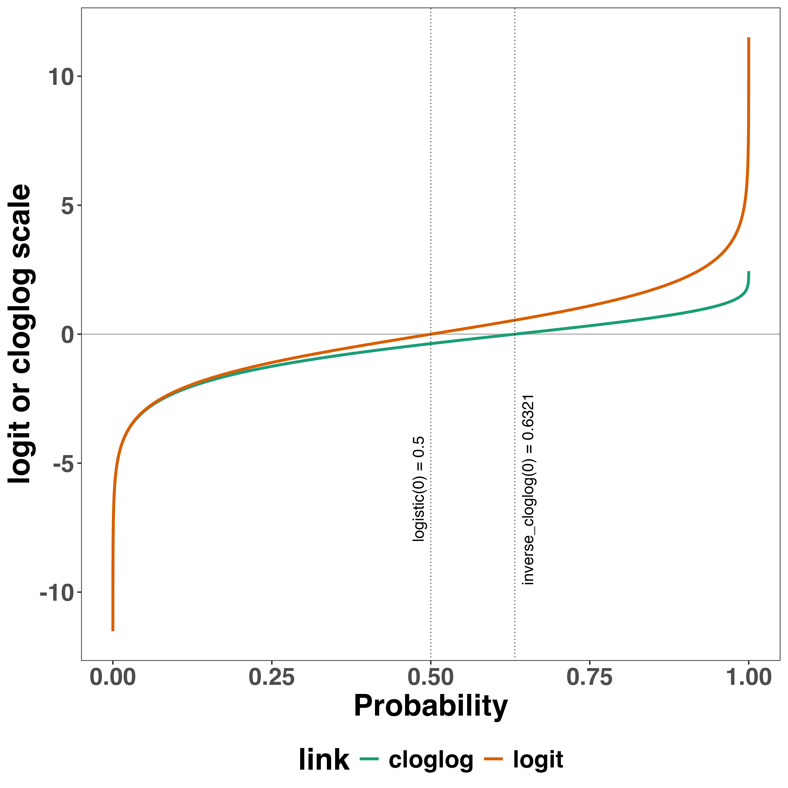

# Supplementary material

## A. Definitions of discrete-time hazard, surivor, probability mass, and conditional accuracy functions

The shape of a distribution of waiting times can be described in multiple ways [@luceResponseTimesTheir1991]. After dividing time in discrete, contiguous time bins indexed by t, let RT be a discrete random variable denoting the rank of the time bin in which a particular person's response occurs in a particular experimental condition. 
Because waiting times can only increase, discrete-time EHA focuses on the discrete-time hazard function 

\noindent h(t) = P(RT = t| RT $\geq$ t)   \hfill  (1)

\noindent and the discrete-time survivor function 

\noindent S(t) = P(RT $>$ t) = [1-h(t)].[1-h(t-1)].[1-h(t-2)]...[1-h(1)]  \hfill  (2)

\noindent and not on the probability mass function 

\noindent P(t) = P(RT = t) = h(t).S(t-1)  \hfill  (3)

\noindent nor the cumulative distribution function 

\noindent F(t) = P(RT $\leq$ t) = 1-S(t)   \hfill  (4)  

The discrete-time hazard function of event occurrence gives you for each bin the probability that the event occurs (sometime) in that bin, given that the event has not occurred yet in previous bins. While the discrete-time hazard function assesses the unique risk of event occurrence associated with each time bin, the discrete-time survivor function cumulates the bin-by-bin risks of event *non*occurrence to obtain the probability that the event occurs afer bin t. The probability mass function cumulates the risk of event occurrence in bin t with the risks of event nonoccurrence in bins 1 to t-1. From equation 3 we find that hazard in bin t is equal to P(t)/S(t-1). 

For two-choice RT data, the discrete-time hazard function can be extended with the discrete-time conditional accuracy function 

\noindent ca(t) = P(correct | RT = t)   \hfill  (5)

\noindent which gives you for each bin the probability that a response is correct given that it is emitted in time bin t [@kantowitzInterpretationReactionTime2021; @wickelgrenSpeedaccuracyTradeoffInformation1977; @allisonSurvivalAnalysisUsing2010]. This latter function is also known as the micro-level speed-accuracy tradeoff (SAT) function.

The survivor function provides a context for the hazard function, as S(t-1) = P(RT > t-1) = P(RT $\geq$ t) tells you on how many percent of the trials the estimate h(t) = P(RT = t| RT $\geq$ t) is based. The probability mass function provides a context for the conditional accuracy function, as P(t) = P(RT = t) tells you on how many percent of the trials the estimate ca(t) = P(correct | RT = t) is based.

When time is treated as a continuous variable, let RT be a continous random variable denoting a particular person's response time in a particular experimental condition. Continuous-time EHA does not focus on the cumulative distribution function F(t) = P(RT $\leq$ t) and its derivative, the probability density function f(t) = F(t)', but on the survivor function S(t) = P(RT $>$ t) and the hazard rate function $\lambda$(t) = f(t)/S(t). The hazard rate function gives you the instantaneous *rate* of event occurrence at time point t, given that the event has not occurred yet. 

## B. Custom functions for descriptive discrete-time hazard analysis

We defined 13 custom functions that we list here. 

* censor(df,timeout,bin_width) : divide the time segment (0,timeout] in bins, identify any right-censored observations, and determine the discrete RT (time bin rank)
* ptb(df) : transform the person-trial data set to the person-trial-bin data set
* setup_lt(ptb) : set up a life table for each level of 1 independent variable
* setup_lt_2IV(ptb) : set up a life table for each combination of levels of 2 independent variables
* calc_ca(df) : estimate the conditinal accuracies when there is 1 independent variable
* calc_ca_2IV(df) : estimate the conditional accuraies when there are 2 independent variables
* join_lt_ca(df1,df2) : add the ca(t) estimates to the life tables (1 independent variable)
* join_lt_ca_2IV(df1,df2) : add the ca(t) estimates to the life tables (2 independent variables)
* extract_median(df) : estimate quantiles S(t)~.50~ (1 independent variable)
* extract_median_2IV(df) : estimate quantiles S(t)~.50~ (2 independent variables)
* plot_eha(df,subj,haz_yaxis) : create plots of the discrete-time functions (1 independent variable)
* plot_eha_2IV(df,subj,haz_yaxis) : create plots of the discrete-time functions (2 independent variables)
* plot_eha_agg(df,subj,haz_yaxis) : create 1 plot for data aggregated across participants (1 independent variable)

When you want to analyse simple RT data from a detection experiment with one independent variable, the functions calc_ca() and join_lt_ca() should not be used, and the code to plot the conditional accuracy functions should be removed from the function plot_eha().
When you want to analyse simple RT data from a detection experiment with two independent variables, the functions calc_ca_2IV() and join_lt_ca_2IV() should not be used, and the code to plot the conditional accuracy functions should be removed from the function plot_eha_2IV().

## C. Link functions

Popular link functions include the logit link and the complementary log-log link, as shown in Figure 11.

(ref:descr-plot11-caption) The logit and cloglog link functions.
 
```{r plot-link-functions, fig.cap = "(ref:descr-plot11-caption)", out.width='80%'}

```

## D. Regression equations

An example (single-level) discrete-time hazard model with three predictors (TIME, X~1~, X~2~), the cloglog link function, and a third-order polynomial specification for TIME can be written as follows:

\noindent cloglog[h(t)] = ln(-ln[1-h(t)]) =  [$\beta$~0~ONE + $\beta$~1~(TIME-9) + $\beta$~2~(TIME-9)$^2$] +                                    [$\beta$~3~X~1~ + $\beta$~4~X~2~ + $\beta$~5~X~2~(TIME-9)]  \hfill  (6)

The main predictor variable TIME is the time bin index t that is centered on value 9 in this example. The first set of terms within brackets, the parameters $\beta$~0~ to $\beta$~2~ multiplied by their polynomial specifications of (centered) time, represents the shape of the baseline cloglog-hazard function (i.e., when all predictors X~i~ take on a value of zero). The second set of terms (the beta parameters $\beta$~3~ to $\beta$~5~) represents the vertical shift in the baseline cloglog-hazard for a 1 unit increase in the respective predictor variable. Predictors can be discrete, continuous, and time-varying or time-invariant. For example, the effect of a 1 unit increase in X~1~ is to vertically shift the whole baseline cloglog-hazard function by $\beta$~1~ cloglog-hazard units. However, if the predictor interacts linearly with TIME (see X~2~ in the example), then the effect of a 1 unit increase in X~2~ is to vertically shift the predicted cloglog-hazard in bin 9 by $\beta$~2~ cloglog-hazard units (when TIME-9 = 0), in bin 10 by $\beta$~2~ + $\beta$~3~ cloglog-hazard units (when TIME-9 = 1), and so forth. To interpret the effects of a predictor, its $\beta$ parameter is exponentiated, resulting in a hazard ratio (due to the use of the cloglog link). When using the logit link, exponentiating a $\beta$ parameter results in an odds ratio.

An example (single-level) discrete-time hazard model with a general specification for TIME (separate intercepts for each of six bins, where D1 to D6 are binary variables identifying each bin) and a single predictor (X~1~) can be written as follows:

\noindent cloglog[h(t)] =  [$\beta$~0~D1 + $\beta$~1~D2 + $\beta$~2~D3 + $\beta$~3~D4 + $\beta$~4~D5 + $\beta$~5~D6] + [$\beta$~6~X~1~]  \hfill  (7)

## E. Prior distributions

To gain a sense of what prior *logit* values would approximate a uniform distribution on the probability scale, @kurzAppliedLongitudinalDataAnalysis2023 simulated a large number of draws from the Uniform(0,1) distribution, converted those draws to the log-odds metric, and fitted a Student's t distribution. Row C in Figure 12 shows that using a t-distribution with 7.61 degrees of freedom and a scale parameter of 1.57 as a prior on the logit scale, approximates a uniform distribution on the probability scale. According to @kurzAppliedLongitudinalDataAnalysis2023, such a prior might be a good prior for the intercept(s) in a logit-hazard model, while the N(0,1) prior in row D might be a good prior for the non-intercept parameters in a logit-hazard model, as it gently regularizes p towards .5 (i.e., a zero effect on the logit scale).

(ref:descr-plot12-caption) Prior distributions on the logit and/or cloglog scales (middle column), and their implications on the probability scale after applying the inverse-logit (or logistic) transformation (left column), and the inverse-cloglog transformation (right column).

```{r plot-priors, fig.cap = "(ref:descr-plot12-caption)", out.width='80%'}
knitr::include_graphics("../Tutorial_2_Bayesian/figures/plot_of_priors.png")
```

To gain a sense of what prior *cloglog* values would approximate a uniform distribution on the hazard probability scale, we followed Kurz's approach and simulated a large number of draws from the Uniform(0,1) distribution, converted them to the cloglog metric, and fitted a skew-normal model (due to the asymmetry of the cloglog link function). Row E shows that using a skew-normal distribution with a mean of -0.59, a standard deviation of 1.26, and a skewness of -4.22 as a prior on the cloglog scale, approximates a uniform distribution on the probability scale. 
However, because hazard values below .5 are more likely in RT studies, using a skew-normal distribution with a mean of -1, a standard deviation of 1, and a skewness of -2 as a prior on the cloglog scale (row F), might be a good weakly informative prior for the intercept(s) in a cloglog-hazard model. 
A skew-normal distribution with a mean of -0.2, a standard deviation of 0.71, and a skewness of -2.2 might be a good weakly informative prior for the non-intercept parameters in a cloglog-hazard model as it gently regularizes p towards .6321 (i.e., a zero effect on the cloglog scale). 

## F. Advantages of hazard analysis

Statisticians and mathematical psychologists recommend focusing on the hazard function when analyzing time-to-event data for various reasons. First, as discussed by @holdenDispersionResponseTimes2009, “probability density [and mass] functions can appear nearly identical, both statistically and to the naked eye, and yet are clearly different on the basis of their hazard functions (but not vice versa). Hazard functions are thus more diagnostic than density functions” (p. 331) when one is interested in studying the detailed shape of a RT distribution [see also Figure 1 in @panisAnalyzingResponseTimes2020]. Therefore, when the goal is to study how psychological effects change over time, hazard and conditional accuracy functions are preferred. 

Second, because RT distributions may differ from one another in multiple ways, @townsendTruthConsequencesOrdinal1990 developed a dominance hierarchy of statistical differences between two arbitrary distributions A and B. For example, if h~A~(t) > h~B~(t) for all t, then both hazard functions are said to show a complete ordering. Townsend (1990) concluded that stronger conclusions can be drawn from data when comparing the hazard functions using EHA. For example, when mean A < mean B, the hazard functions might show a complete ordering (i.e., for all t), a partial ordering (e.g., only for t > 300 ms, or only for t < 500 ms), or they may cross each other one or more times.

Third, EHA does not discard right-censored observations when estimating hazard functions, that is, trials for which we do not observe a response during the data collection period in a trial so that we only know that the RT must be larger than some value (e.g., the response deadline). This is important because although a few right-censored observations are inevitable in most RT tasks, a lot of right-censored observations are expected in experiments on masking, the attentional blink, and so forth. In other words, by using EHA you can analyze RT data from experiments that typically do not measure response times. As a result, EHA can also deal with long RTs in experiments without a response deadline, which are typically treated as outliers and are discarded before calculating a mean. This orthodox procedure leads to underestimation of the true mean. By introducing a fixed censoring time for all trials at the end of the analysis time window, trials with long RTs are not discarded but contribute to the risk set of each bin.

Fourth, hazard modeling allows incorporating time-varying explanatory covariates such as heart rate, electroencephalogram (EEG) signal amplitude, gaze location, etc. (Allison, 2010). This is useful for linking physiological effects to behavioral effects when performing cognitive psychophysiology [@meyerModernMentalChronometry1988].

Finally, as explained by @kelsoOutlineGeneralTheory2013, it is crucial to first have a precise description of the macroscopic behavior of a system (here: h(t) and possibly ca(t) functions) in order to know what to derive on the microscopic level. EHA can thus solve the problem of model mimicry, i.e., the fact that different computational models can often predict the same mean RTs as observed in the empirical data, but not necessarily the detailed shapes of the empirical RT hazard distributions. Also, fitting parametric functions or computational models to data without studying the shape of the empirical discrete-time h(t) and ca(t) functions can miss important features in the data [@panisStudyingDynamicsVisual2020; @panisWhatShapingRT2016].
