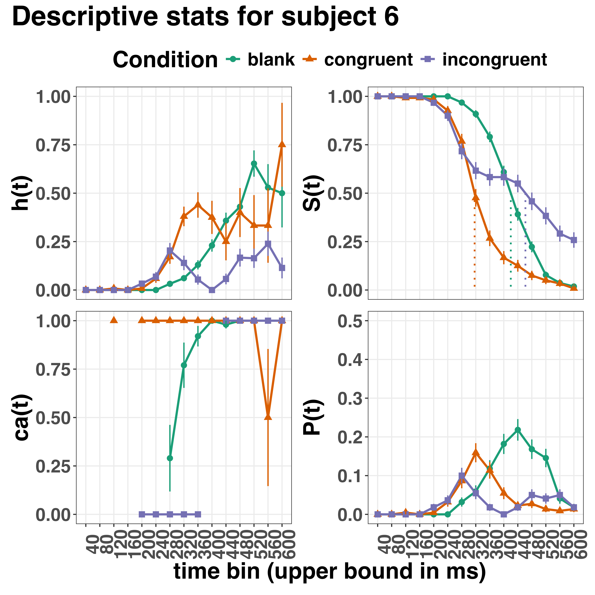

```{r setup, include = FALSE}
# Tutorials 1 and 4
pkg1 <- c("papaja", "citr", "tidyverse", "RColorBrewer", "patchwork")

lapply(pkg1, library, character.only = TRUE)

# Tutorial 2
pkg2 <- c("cmdstanr", "standist", "tidyverse", "RColorBrewer", "patchwork", 
         "brms", "tidybayes", "bayesplot", "future", "parallel")

lapply(pkg2, library, character.only = TRUE)

options(brms.backend = "cmdstanr",
        mc.cores = parallel::detectCores(),
        future.fork.enable = TRUE,
        future.rng.onMisuse = "ignore") ## automatically set in RStudio

supportsMulticore()
detectCores()

# Tutorial 3
pkg3 <- c("lme4", "nlme")

lapply(pkg3, library, character.only = TRUE)

# R references
r_refs(file = "r-references.bib", append=F) # append=F prevents multiple copies of the same citation...
my_r_citation <- cite_r(file = "r-references.bib", footnote = TRUE) ## 
```

```{r analysis-preferences}
# Seed for random number generation
set.seed(42)
knitr::opts_chunk$set(cache.extra = knitr::rand_seed)
```

```{r plot-settings}
## theme settings for ggplot
theme_set(
  theme_bw() +
    theme(text = element_text(size = 18), 
          title = element_text(size = 18),
          legend.position = "bottom")
)

## Set the amount of dodge in figures
pd <- position_dodge(0.7)
pd2 <- position_dodge(1)
```

```{r global-chunk-settings}
## set the figure options
knitr::opts_chunk$set(fig.pos='H', out.extra = '', out.height = "67%",
                      fig.align = "center") 
```

# 1. Introduction

## 1.1 Motivation and background context: Comparing means versus distributional shapes 

In experimental psychology, it is standard practice to analyse response times (RTs), saccade latencies, and fixation durations by calculating average performance across a series of trials. Such mean-average comparisons have been the workhorse of experimental psychology over the last century, and have had a substantial impact of theory development and our understanding of the structure of cognition and brain function. However, differences in mean RT conceal when an experimental effect starts, how long it lasts, how it evolves with increasing waiting time, and whether its onset is time-locked to other events [@panisHowCanWe2020; @panisNeuropsychologicalEvidenceTemporal2017; @panisStudyingDynamicsVisual2020; @panisTimecourseContingenciesPerceptual2009; @panisWhatShapingRT2016; @panisWhenDoesInhibition2022]. Such information is useful not only for interpretation of the effects, but also for cognitive psychophysiology and computational model selection [@panisAnalyzingResponseTimes2020].

As a simple illustration, Figure 1 shows the results of several simulated RT datasets, which show how mean-average comparisons between two conditions can conceal the shape of the underlying RT distributions. For instance, in examples 1-3, mean RT is always comparable between two conditions, while the distribution differs (Figure 1, top row). In contrast, in examples 4-6, mean RT is lower in condition 2 compared to condition 1, but the RT distribution differs in each case (Figure 1, bottom row). Therefore, a comparison of means would lead to a similar conclusion in examples 1-3, as well as examples 4-6, whereas a comparison of the distribution would lead to a different conclusion in every case.

(ref:descr-fig1-caption) Means versus distributional shapes for six different simulated dataset examples. For our purposes here, it is enough to know that the distributions plotted represent the probability of an event occurring in that timebin, given that it has not yet occurred. Insets show mean reaction time per condition.

```{r plot1, fig.cap = "(ref:descr-fig1-caption)", out.width="90%"}
knitr::include_graphics("../sims/figures/haz_inset_facet.jpeg")
```

Why does this matter for research in psychology? Compared to the aggregation of data across trials, a distributional approach offers the possibility to reveal the timecourse of psychological states. As such, the approach permits different kinds of questions to be asked, different inferences to be made, and it holds the potential to discriminate between different theoretical accounts of psychological and/or brain-based processes.
For example, the distributions in Example 4 show that the effect starts around 200 ms and is gone by 600 ms. In contrast, in Example 5, the effect starts around 400 ms and is gone by 800 ms. And in the Example 6, the effect reverses around between 500 and 600 ms. What kind of theory or set of theories could account for such effects? Are there new auxiliary assumptions that theories need to adopt? And are there new experiments that need to be run to test the novel predictions that follow from these analyses? As we show later using concrete examples from past experimental data, for many psychological questions this "temporal states" information can be theoretically meaningful by leading to more fine-grained understanding of psychological processes as well as adding a relatively under-used dimension -- the passage of waiting time -- to our theory building toolkit.

From a historical perspective, it is worth noting that the development of analytical tools that can estimate or predict whether and when events will occur is not a new endeavour.
Indeed, hundreds of years ago, analytical methods were developed to predict time to death (REFs).
The same logic has been applied to psychological time-to-event data, as previously demonstrated (Panis et al., 2020).
Here, in the paper, we hope to show the value of EHA for knowledge and theory building in cognitive psychology and related areas of research, such as cognitive neuroscience, as well as provide practical tutorials that provide step-by-step code and instructions in the hope that we can enable others to use EHA in a more routine, efficient and effective manner.

## 1.2 Aims and structure of the paper

In this paper, we focus on a distributional method for time-to-event data known as discrete-time event history analysis, a.k.a. hazard analysis, duration analysis, failure-time analysis, survival analysis, and transition analysis.
We first provide a brief overview of hazard analysis to orient the reader to the basic concepts that we will use throughout the paper. However, this will remain relatively short, as this has been covered in detail before [@singerAppliedLongitudinalData2003; @allisonDiscreteTimeMethodsAnalysis1982; @allisonSurvivalAnalysisUsing2010], and our primary aim here is to introduce a set of tutorials, which explain **how** to do such analyses, rather than repeat in any detail **why** you should do them.  

We then provide six different tutorials, each of which is written in the R programming language and publicly available on our Github and the Open Science Framework (OSF) pages, along with all of the other code and material associated with the project. The tutorials provide hands-on, concrete examples of key parts of the analytical process, so that others can apply the analyses to their own time-to-event data sets. Each tutorial is provided as an RMarkdown file, so that others can download and adapt the code to fit their own purposes. Additionally, each tutorial is made available as .html file, so that it can be viewed by any web browser, and thus available to those that do not use R. 

In Tutorial 1a, we illustrate how to process or "wrangle" a previously published RT + accuracy data set to calculate descriptive statistics when there is one independent variable. The descriptive statistics are plotted, and we comment on their interpretation. In Tutorial 1b we provide a generalisation of this approach to illustrate how one can calculate the descriptive statistics when using a more complex design, such as when there are two independent variables. In Tutorial 2a, we illustrate how one can fit Bayesian multi-level regression models to RT data using the R package brms. We discuss possible link functions, and plot the model-based effects of our predictors of interest. In Tutorial 2b we fit Bayesian multi-level regression models to *timed* accuracy data to perform a micro-level speed-accuracy tradeoff (SAT) analysis, which complements the hazard analysis. In Tutorial 3a, we illustrate how to fit the same type of hazard regression models in a frequentist framework using the R package lme4. We then briefly compare and contrast these inferential frameworks when applied to EHA. In Tutorial 3b, we illustrate how to perform the SAT analysis in a frequentist framework.

In summary, even though event history analyses is a widely used statistical tool and there already exist many excellent reviews (REFs) and tutorials [@allisonSurvivalAnalysisUsing2010] on its general use-cases, we are not aware of any tutorials that are aimed at psychological time-to-event data, and which provide worked examples of the key data processing and multi-level regression modelling steps. 
Thereofore, our ultimate goal is twofold: first, we want to convince readers of the many benefits of using hazard analysis when dealing with time-to-event data with a focus on psychological time-to-event data, and second, we want to provide a set of practical tutorials, which provide step-by-step instructions on how you actually perform a discrete-time hazard analysis on time-to-event data, as well as a complementary discrete-time SAT analysis on timed accuracy data.

# 2. A brief introduction to hazard analysis

For a comprehensive background context to hazard analysis, we recommend several excellent textbooks [@singerAppliedLongitudinalData2003]. Likewise, for general introduction to understanding regression equations, we recommend several introductory level textbooks (REFs). Our focus here is not on providing a detailed account of the underlying regression equations, since this topics has been comprehensively covered many times before. Instead, we want to provide an intuition to how EHA works in general as well as in the context of experimental psychology. As such, we only supply regression equations in the supplementary material (part D) and then refer to them in the text whenever relevant.

## 2.1 Basic features of hazard analysis 

To apply event history analysis (EHA), one must be able to:

1. define an event of interest that represents a qualitative change that can be situated in time (e.g., a button press, a saccade onset, a fixation offset, etc.)

2. define time point zero (e.g., target stimulus onset, fixation onset)

3. measure the passage of time between time point zero and event occurrence in discrete or continuous time units. 

The definition of hazard and the type of models employed depend on whether one is using continuous or discrete time units. Since our focus here is on hazard models that use discrete time units, we describe that approach. After dividing time in discrete, contiguous time bins indexed by t (e.g., t = 1:10 timebins), let RT be a discrete random variable denoting the rank of the time bin in which a particular person's response occurs in a particular experimental condition. For example, the first response might occur at 546 ms and it would be in timebin 6 (any RTs from 501 ms to 600). Continuous RT data is treated here as interval-censored data.

Discrete-time EHA focuses on the discrete-time hazard function and the discrete-time survivor function (Figure 2). The equations that define both of these functions are reported in the supplementary material (equations 1 and 2 in part A). The discrete-time hazard probability gives you the probability that the event occurs (sometime) in bin t, given that the event does not occur in previous bins. In other words, it reflects the instantaneous likelihood that the event occurs in the current bin, given that it has not yet occurred in the past, i.e., in one of the prior bins. This conditionality in the definition of hazard is what makes the hazard function so diagnostic for studying event occurrence, as an event can physically not occur when it has already occurred before. In contrast, the discrete-time survivor function cumulates the bin-by-bin risks of event *non*occurrence to obtain the probability that the event occurs after bin t. In other words, the survivor function reflects the likelihood that the event occurs in the future, i.e., in one of the subsequent timebins. 

The survivor function can help to qualify or provide context to the interpretation of the hazard function. For example, it can give a sense of how many trials contribute to each part of the hazard distribution. If a participant completes 100 trials in an experiment, and the survivor function reaches a probability of 0.03 at the end of timebin (400,500], then only 3% of trials remain beyond this point, which in this case would amount to 3 trials. Therefore, the error bars in later parts of the hazard function would be wider and less precise compared to earlier parts.

(ref:descr-plot2-caption) Hazard and survivor functions

```{r plot2, fig.cap = "(ref:descr-plot2-caption)", out.width="80%"}

```

## 2.2 Hazard analysis in the context of experimental psychology

### 2.2.1 A worked example 

In the context of experimental psychology, it is common for participants to be presented with a task that has a right and a wrong answer. For example, a task may involve choosing between two response options with only one of them being correct. For such two-choice RT data, the discrete-time hazard analysis can be extended with a discrete-time SAT analyis. Specifically, the hazard function of event occurrence can be extended with the discrete-time conditional accuracy function (see equation 5 in part A of the supplementary material), which gives you the probability that a response is correct given that it is emitted in time bin t [@kantowitzInterpretationReactionTime2021; @wickelgrenSpeedaccuracyTradeoffInformation1977; @allisonSurvivalAnalysisUsing2010]. 

Integrating results between hazard and conditional accuracy functions can be informative for understanding psychological processes. To illustrate, we consider a hypothetical example that is inspired by real data (Panis et al., 2016), but simplified to make the main point clearer (Figure 3). In a standard response priming paradigm, there is a prime stimulus (e.g., an arrow pointing left or right) followed by a target stimulus (another arrow pointing left or right). The prime can then be congruent or incongruent with the target. Figure 3 shows that the early upswing in hazard is equal for both prime conditions, and that early responses are always correct in the congruent condition and always incorrect in the incongruent condition. These results show that for early responses (< bin 6), responses always follow the prime (and not the target, as instructed). And then for later bins, response hazard is lower in incongruent compared to congruent trials, and all responses emitted in these later bins are correct. This is interesting because mean-average RT would only represent the overall ability of cognition to overcome interference, on average, across trials. And such a conclusion is not supported when the effects are explored over a timeline. Instead, the psychological conclusion is much more nuanced and suggests that multiple states start, stop and possibly interact over a particular temporal window.

(ref:descr-plot3-caption) Hazard and conditional accuracy

```{r plot3, fig.cap = "(ref:descr-plot3-caption)", out.width="80%"}
knitr::include_graphics("../sims/figures/haz_acc.jpeg")
```

Unlocking the temporal states of cognitive processes can be revealing in and of itself for theory development and the understanding of basic psychological processes. Possibly more importantly, however, is that it simultaneously opens the door to address many new and previously unanswered questions. Do all participants show similar temporal states or are there individual differences? Do such individual differences extend to those individuals that have been diagnosed with some form of psychopathology? How do temporal states relate to brain-based mechanisms that might be studied using other methods from cognitive neuroscience? And how much of theory in cognitive psychology would be in need of revision if mean-average comparisons were supplemented with a temporal states approach?

### 2.2.2 Implications for designing experiments

Performing hazard analyses in experimental psychology has implications for how experiments are designed. Indeed, if trials are categorised as a function of when responses occur, then each timebin will only include a subset of the total number of trials. For example, let's consider an experiment where each participant performs 2 conditions and there are 100 trial repetitions per condition. Those 100 trials must be distributed in some manner across the chosen number of bins.

In such experimental designs, since the number of trials per condition are spread across bins, it is important to have a relatively large number of trial repetitions per participant and per condition. Accordingly, experimental designs using this approach typically focus on factorial, within-subject designs, in which a large number of observations are made on a relatively small number of participants (so-called small-*N* designs). This approach  emphasizes the precision and reproducibility of data patterns at the individual participant level to increase the inferential validity of the design [@bakerPowerContoursOptimising2021; @smithSmallBeautifulDefense2018]. 

In contrast to the large-*N* design that typically average across many participants without being able to scrutinize individual data patterns,  small-*N*  designs  retain  crucial  information  about  the  data  patterns of individual observers. This can be advantageous whenever participants differ systematically in their strategies or in the time-courses of their effects, so that averaging them would lead to misleading data patterns. Note that because statistical power derives both from the number of participants and from the number of repeated measures per participant and condition, small-*N* designs can still achieve what are generally considered acceptable levels of statistical power, if they have have a sufficient amount of data overall [@bakerPowerContoursOptimising2021; @smithSmallBeautifulDefense2018].

We used `r my_r_citation$r` for all reported analyses. The content of the tutorials is mainly based on @allisonSurvivalAnalysisUsing2010, @singerAppliedLongitudinalData2003, @mcelreathStatisticalRethinkingBayesian2018, @kurzAppliedLongitudinalDataAnalysis2023, and @kurzStatisticalRethinkingSecondEd2023.

`r my_r_citation$pkgs`

<!-- This creates the footnote -->

# 3. An overview of the general analytical workflow

Although the focus is on EHA, we also want to briefly comment on broader aspects of our general analytical workflow, which relate more to data science and data analysis workflows.

## 3.1 Data science workflow and descriptive statistics

Descriptive, data science workflow.
Data wrangling via tidyverse principles and a functional programming approach (cite R4DS textbook here).
Functional programming basically means you don't write your own loops but instead use functions that have been built and tested by others.
[[more here, as necessary]].

## 3.2 Inferential statistical approach 

Our lab adopts a estimation approach to multi-level regression (Kruschke & Liddel, 2018; Winter, 2019), which is heavily influenced by Bayesian approach as suggested by Richard McElreath (McElreath, 2020; Kurz, 202?). We also use a "keep it maximal" approach to specifying varying (or random) effects (Barr et al., 2013). This means that wherever possible we include varying intercepts and slopes per participant 
To make inferences, we use two main approaches. We compare models of different complexity, using information criteria, such as WAIC or LOO, to evaluate out-of-sample predictive accuracy. We also take the most complex model and evaluate key parameters of interest using point and interval estimates.  

# 4. Tutorials

Tutorials 1a and 1b show how to calculate and plot the descriptive statistics when there are one and two independent variables, respectively. Tutorials 2a and 2b illustrate how to use Bayesian multilevel modeling to fit hazard and conditional accuracy models, respectively. Tutorials 3a and 3b show how to implement, respectively, multilevel models for hazard and conditional accuracy in the frequentist framework.
Additionally, to further simplify the process for other users, the tutorials rely on a set of our own custom functions that make sub-processes easier to automate, such as data wrangling and plotting functions (see part B in the supplemental material for a list of the custom functions).

Our list of tutorials is as follows:

* 1a. Wrangle raw data and descriptive stats for one independent variable.
* 1b. Wrangle raw data and descriptive stats for two independent variables.
* 2a. Bayesian multilevel modeling for h(t)
* 2b. Bayesian multilevel modeling for ca(t)
* 3a. Frequentist multilevel modeling for h(t)
* 3b. Frequentist multilevel modeling for ca(t)

Plannng (T4) - if we get a simulation and power analysis script working, which we are happy with then we could include it here.

## 4.1 Tutorial 1a: Calculating descriptive statistics using a life table

### 4.1.1 Data wrangling aims 

Our data wrangling procedures serve two related purposes. First, we want to summarise and visualise descriptive statistics that relate to our main research questions about the timecourse of psychological processes. Second, we want to produce two different data sets that can each be submitted to different types of inferential modelling approaches. The two types of data structure we label as 'person-trial' data and 'person-trial-bin' data. The 'person-trial' data (Table 1) will be familiar to most researchers who record behavioural responses from participants, as it represents the measured RT and accuracy per trial within an experiment. This data set is used when fitting conditional accuracy models. 

```{r}
## make it reproducible
set.seed(123)

## create the ca data
ca <- tibble(
  pid = as.integer(rep(1, times=10)),
  trial = 1:10,
  condition = sample(rep(c("congruent", "incongruent"), each = 5)),
  rt = rnorm(10, 500, 100),
  accuracy = rbinom(10,1,0.7)
)

## create the ha data
ha <- tibble(
  pid = c(rep(1, times=9)),
  trial = c(rep(1, times=4), rep(2,times=5)),
  condition = c(rep("congruent", times=4), rep("incongruent", times=5)),
  timebin = c(seq(1,4), seq(1,5)),
  event = c(0, 0, 0, 1, 0, 0, 0, 0, 1)
) %>% 
  mutate_if(is.numeric, as.integer)
```

(ref:ca-data-table-caption) Data structure for 'person-trial' data

(ref:ca-data-note-caption) The first 10 trials for participant 1 are shown. These data are simulated and for illustrative purposes only.

```{r ca-data-table}
apa_table(
  ca,
  caption = "(ref:ca-data-table-caption)",
  note = "(ref:ca-data-note-caption)",
  placement = "H"
)
```

In contrast, the 'person-trial-bin' data (Table 2) has a different, more extended structure, which indicates in which bin a response occurred, if at all, in each trial. Therefore, the 'person-trial-bin' dataset generates a 0 in each bin until an event occurs and then it generates a 1 to signal an event has occurred in that bin. This data set is used when fitting hazard models. It is worth pointing out that there is no requirement for an event to occur at all (in any bin), as maybe there was no response on that trial or the event occurred after the time window of interest. Likewise, when the event occurs in bin 1 there would only be one row of data for that trial in the person-trial-bin data set.

(ref:ha-data-table-caption) Data structure for 'person-trial-bin' data

(ref:ha-data-note-caption) The first 2 trials for participant 1 from Table 1 are shown. The width of the time bins is 100 ms. These data are simulated and for illustrative purposes only.

```{r ha-data-table}
apa_table(
  ha,
  caption = "(ref:ha-data-table-caption)",
  note = "(ref:ha-data-note-caption)",
  placement = "H"
)
```

### 4.1.2 A real data wrangling example 

To illustrate how to quickly set up life tables for calculating the descriptive statistics (functions of discrete time), we use a published data set on masked response priming from @panisWhatShapingRT2016.
In their first experiment, @panisWhatShapingRT2016 presented a double arrow for 94 ms that pointed left or right as the target stimulus with an onset at time point zero in each trial. Participants had to indicate the direction in which the double arrow pointed using their corresponding index finger, within 800 ms after target onset. Response time and accuracy were recorded on each trial. Prime type (blank, congruent, incongruent) and mask type were manipulated. Here we focus on the subset of trials in which no mask was presented. The 13-ms prime stimulus was a double arrow with onset at -187 ms for the congruent (same direction as target) and incongruent (opposite direction as target) prime conditions.

There are several data wrangling steps to be taken. First, we need to load the data before we (a) supply required column names, and (b) specify the factor condition with the correct levels and labels.

The required column names are as follows:

* "pid", indicating unique participant IDs;
* "trial", indicating each unique trial per participant;
* "condition", a factor indicating the levels of the independent variable (1, 2, ...) and the corresponding labels;
* "rt", indicating the response times in ms;
* "acc", indicating the accuracies (1/0).

In the code of Tutorial 1a, this is accomplished as follows.

\scriptsize
```{r setup-data-tut1, echo=TRUE}
data_wr <- read_csv("../Tutorial_1_descriptive_stats/data/DataExp1_6subjects_wrangled.csv")
colnames(data_wr) <- c("pid","bl","tr","condition","resp","acc","rt","trial") 
data_wr <- data_wr %>% 
  mutate(condition = condition + 1, # original levels were 0, 1, 2.
         condition = factor(condition, levels=c(1,2,3), labels=c("blank","congruent","incongruent")))
```
\normalsize

Next, we can set up the life tables and plots of the discrete-time functions h(t), S(t), ca(t), and P(t) -- see part A of the supplementary material. To do so using a functional programming approach, one has to nest the data within participants using the group_nest() function, and supply a user-defined censoring time and bin width to our custom function "censor()", as follows.

\scriptsize
```{r nest-apply-functions-tut1, echo = TRUE, eval=F}
data_nested <- data_wr %>% group_nest(pid)
data_final <- data_nested %>% 
  mutate(censored  = map(data, censor, 600, 40)) %>%   # ! user input: censoring time, and bin width
  mutate(ptb_data  = map(censored, ptb)) %>%           # create person-trial-bin dataset
  mutate(lifetable = map(ptb_data, setup_lt)) %>%      # create life tables without ca(t)
  mutate(condacc   = map(censored, calc_ca)) %>%       # calculate ca(t)
  mutate(lifetable_ca = map2(lifetable, condacc, join_lt_ca)) %>%    # create life tables with ca(t)
  mutate(plot      = map2(.x = lifetable_ca, .y = pid, plot_eha,1))  # create plots 
```
\normalsize

Note that the censoring time should be a multiple of the bin width (both in ms). The censoring time should be a time point after which no informative responses are expected anymore. In experiments that implement a response deadline in each trial the censoring time can equal that deadline time point. Trials with a RT larger than the censoring time, or trials in which no response is emitted during the data collection period, are treated as right-censored observations in EHA. In other words, these trials are not discarded, because they contain the information that the event did not occur before the censoring time. Removing such trials before calculating the mean event time can introduce a sampling bias (REFs). The person-trial-bin oriented dataset has one row for each time bin of each trial that is at risk for event occurrence. The variable "event" in the person-trial-bin oriented data set indicates whether a response occurs (1) or not (0) for each bin.

The next step is to plot the data using our custom function plot_eha(). When creating the plots, some warning messages will likely be generated, like these:

* Removed 2 rows containing missing values or values outside the scale range (`geom_line()`). 
* Removed 2 rows containing missing values or values outside the scale range (`geom_point()`). 
* Removed 2 rows containing missing values or values outside the scale range (`geom_segment()`).

The warning messages are generated because some bins have no hazard and ca(t) estimates, and no error bars. They can thus safely be ignored.
One can now inspect different aspects, including the life table for a particular condition of a particular subject, and a plot of the different functions for a particular participant. It is important to visually inspect the functions first for each participant, in order to identify possible cheaters (e.g., a flat conditional accuracy function at .5 indicates (s)he was only guessing), outlying individuals, and/or different groups with qualitatively different behavior. 

Table 3 shows the life table for condition "blank" (no prime stimulus presented) for participant 6 -- compare to Figure 1. A life table includes for each time bin, the risk set (number of trials that are event-free at the start of the bin), the number of observed events, and the estimates of h(t), S(t), possibly ca(t), and their estimated standard errors (se). At time point zero, no events can occur and therefore h(t) and ca(t) are undefined.

Figure 4 displays the discrete-time hazard, survivor, conditional accuracy, and probability mass functions for each prime condition for participant 6. By using discrete-time h(t) functions of event occurrence -- in combination with ca(t) functions for two-choice tasks -- one can provide an unbiased, time-varying, and probabilistic description of the latency and accuracy of responses based on all trials of any data set. 

```{r load-data}
load("../Tutorial_1_descriptive_stats/data/descr_stats_tut1a.Rdata") # loads data_final
```

For example, for participant 6, the estimated hazard values in bin (240,280] are `r data_final[[7]][[6]] %>% filter(condition=="blank") %>% select(hazard) %>% slice(7) %>% pull()`, `r data_final[[7]][[6]] %>% filter(condition=="congruent") %>% select(hazard) %>% slice(7) %>% pull()`, and `r data_final[[7]][[6]] %>% filter(condition=="incongruent") %>% select(hazard) %>% slice(7) %>% pull()` for the blank, congruent, and incongruent prime conditions, respectively. In other words, when the waiting time has increased until *240 ms* after target onset, then the conditional probability of response occurrence in the next 40 ms is more than five times larger for both prime-present conditions, compared to the blank prime condition. 

Furthermore, the estimated conditional accuracy values in bin (240,280] are `r data_final[[7]][[6]] %>% filter(condition=="blank") %>% select(ca) %>% slice(7) %>% pull()`, `r data_final[[7]][[6]] %>% filter(condition=="congruent") %>% select(ca) %>% slice(7) %>% pull()`, and `r data_final[[7]][[6]] %>% filter(condition=="incongruent") %>% select(ca) %>% slice(7) %>% pull()` for the blank, congruent, and incongruent prime conditions, respectively. In other words, if a response is emitted in bin (240,280], then the probability that it is correct is estimated to be `r data_final[[7]][[6]] %>% filter(condition=="blank") %>% select(ca) %>% slice(7) %>% pull()`, `r data_final[[7]][[6]] %>% filter(condition=="congruent") %>% select(ca) %>% slice(7) %>% pull()`, and `r data_final[[7]][[6]] %>% filter(condition=="incongruent") %>% select(ca) %>% slice(7) %>% pull()` for the blank, congruent, and incongruent prime conditions, respectively.

(ref:life-table-caption) The life table for the blank prime condition of participant 6.

(ref:life-note-caption) The column named "bin" indicates the endpoint of each time bin (in ms), and includes time point zero. For example the first bin is (0,40] with the starting point excluded and the endpoint included. se = standard error. ca = conditional accuracy.

```{r life-table}
life_tab <- read_csv("../Tutorial_1_descriptive_stats/tables/lifetable_neutral_s6.csv")

apa_table(
  life_tab,
  caption = "(ref:life-table-caption)",
  note = "(ref:life-note-caption)",
  placement = "H"
)
```

(ref:descr-plot4-caption) Estimated discrete-time hazard, survivor, and conditional accuracy functions for participant 6, as a function of the passage of discrete waiting time.

```{r eha-plot, fig.cap = "(ref:descr-plot4-caption)"}

```

   However, when the waiting time has increased until *400 ms* after target onset, then the conditional probability of response occurrence in the next 40 ms is estimated to be `r data_final[[7]][[6]] %>% filter(condition=="blank") %>% select(hazard) %>% slice(11) %>% pull()`, `r data_final[[7]][[6]] %>% filter(condition=="congruent") %>% select(hazard) %>% slice(11) %>% pull()`, and `r data_final[[7]][[6]] %>% filter(condition=="incongruent") %>% select(hazard) %>% slice(11) %>% pull()` for the blank, congruent, and incongruent prime conditions, respectively. And when a response does occur in bin (400,440], then the probability that it is correct is estimated to be `r data_final[[7]][[6]] %>% filter(condition=="blank") %>% select(ca) %>% slice(11) %>% pull()`, `r data_final[[7]][[6]] %>% filter(condition=="congruent") %>% select(ca) %>% slice(11) %>% pull()`, and `r data_final[[7]][[6]] %>% filter(condition=="incongruent") %>% select(ca) %>% slice(11) %>% pull()` for the blank, congruent, and incongruent prime conditions, respectively.
 
When participants show qualitatively the same distributional patterns, on might consider to aggregate their data and make one plot (see Tutorial_1a.Rmd).
 
  These results suggest that the participant is initially responding to the prime even though (s)he was instructed to only respond to the target, that response competition emerges in the incongruent prime condition around 300 ms, and that only later response are fully controlled by the target stimulus. Qualitatively similar results were obtained for the other five participants. 
  
  These results go against the (often implicit) assumption that all observed responses are primed responses to the target stimulus. Instead, the distributional data show that early responses are triggered exclusively by the prime stimulus, while only later responses reflect primed responses to the target stimulus.
  
At this point, we have calculated, summarised and plotted descriptive statistics for the key variables in EHA. As we will show in Tutorials 2 and 3, statistical models for h(t) and ca(t) can be implemented as generalized linear mixed regression models predicting event occurrence (1/0) and accuracy (1/0) in each bin of a selected time window for analysis. As such, multi-level regression is what we turn to in those tutorials. But first we consider calculating the descriptive statistics for two independent variables. 

## 4.2 Tutorial 1b: Generalising to a more complex design

So far in this paper, we have use a simple experimental design, which involved one condition with three levels. But psychological experiments are often more complex, with crossed factorial designs with more conditions and more than three levels. The purpose of Tutorial 1b, therefore, is to provide a generalisation of the basic approach, which extends to a more complicated design. We felt that this might be useful for researchers in experimental psychology that typically use crossed factorial designs.

To this end, Tutorial 1b illustrates how to calculate and plot the descriptive statistics for the full data set of Experiment 1 of @panisWhatShapingRT2016, which includes two independent variables: mask type and prime type. As we use the same functional programming approach as in Tutorial 1a, we simply present the sample-based functions for participant 6 in Figure 5. 

In the no-mask condition (column 1 in Figure 5), we observe a positive compatibility effect in the hazard and ca(t) functions, as congruent primes temporarily generate higher values for hazard and conditional accuracy compared to incongruent primes. However, when a (relevant, irrelevant, or lines) mask is present (columns 2-4), there is a negative compatibility effect in the hazard and conditional accuracy functions, as congruent primes temporarily generate *lower* values for hazard and conditional accuracy compared to incongruent primes.

(ref:descr-plot5-caption) Sample-based discrete-time hazard, survivor, and conditional accuracy functions for participant 6, as a function of prime type (blank, congruent, incongruent) and mask type (no mask, relevant, irrelevant, lines).

```{r plot-2ivs, fig.cap = "(ref:descr-plot5-caption)", out.width='95%'}
knitr::include_graphics("../Tutorial_1_descriptive_stats/figures/Plot_2IV_for_subject6_PanisSchmidt.png")
```

## 4.3 Tutorial 2a: Fitting Bayesian hazard models to time-to-event data

In this third tutorial, we illustrate how to fit Bayesian hazard regression models to the masked response priming data set used in Tutorial 1a. Fitting (Bayesian or non-Bayesian) regression models to the data is important when you want to study how the shape of the hazard function depends on various predictors [@singerAppliedLongitudinalData2003]. 

### 4.3.1 Hazard model considerations 

There are several analytic decisions one has to make when fitting a hazard model. First, one has to select an analysis time window, i.e., a contiguous set of bins for which there is enough data for each participant. Second, given that the dependent variable is binary, one has to select a link function (see part C in the supplementary material). The cloglog link is preferred over the logit link when events can occur in principle at any time point within a bin, which is the case for RT data [@singerAppliedLongitudinalData2003]. Third, one has to choose a specification of the effect of discrete TIME (i.e., the time bin index t). One can choose a general specification (one intercept per bin) or a functional specification, such as a polynomial one (compare model 1 with models 2, 3, and 4 below). We provide relevant example regression formulas in part D of the supplementary material.

In the case of a large-*N* design without repeated measurements, the parameters of a discrete-time hazard model can be estimated using standard logistic regression software after expanding the typical person-trial-oriented data set into a person-trial-bin-oriented data set [@allisonSurvivalAnalysisUsing2010]. When there is clustering in the data, as in the case of a small-*N* design with repeated measurements, the parameters of a discrete-time hazard model can be estimated using population-averaged methods (e.g., Generalized Estimating Equations), and Bayesian or frequentist generalized linear mixed models [@allisonSurvivalAnalysisUsing2010]. 

In general, there are three assumptions one can make or relax when adding experimental predictor variables and other covariates: The linearity assumption for continuous predictors (the effect of a 1 unit change is the same anywhere on the scale), the additivity assumption (predictors do not interact), and the proportionality assumption (predictors do not interact with TIME).

In this tutorial we will fit four Bayesian multilevel models (i.e., generalized linear mixed models) that differ in complexity to the person-trial-bin oriented data set that we created in Tutorial 1a. We select the analysis range (200,600] and the cloglog link. The data is prepared as follows.

\scriptsize
```{r prepare-data, echo=T}
# load person-trial-bin oriented data set
ptb_data <- read_csv("../Tutorial_1_descriptive_stats/data/inputfile_hazard_modeling.csv")

# select analysis time range: (200,600] with 10 bins (time bin ranks 6 to 15)
ptb_data <- ptb_data %>% filter(period > 5)

# create factor condition, with "blank" as the reference level
ptb_data <- ptb_data %>% mutate(condition = factor(condition, labels = c("blank", "congruent","incongruent")))

# center TIME (period) on bin 9, and trial on trial 1000 and rescale; Add dummy variables for each bin.
ptb_data <- ptb_data %>% 
        mutate(period_9 = period - 9,
               trial_c = (trial - 1000)/1000,
               d6  = if_else(period == 6, 1, 0),
               d7  = if_else(period == 7, 1, 0),
               d8  = if_else(period == 8, 1, 0),
               d9  = if_else(period == 9, 1, 0),
               d10 = if_else(period == 10, 1, 0),
               d11 = if_else(period == 11, 1, 0),
               d12 = if_else(period == 12, 1, 0),
               d13 = if_else(period == 13, 1, 0),
               d14 = if_else(period == 14, 1, 0),
               d15 = if_else(period == 15, 1, 0))
```
\normalsize

### 4.3.2 Prior distributions

To get the posterior distribution of each model parameter given the data, we need to specify a prior distribution for each parameter. The middle column of Figure 12 in part E of the supplementary material shows seven examples of prior distributions on the logit and/or cloglog scales.

While a normal distribution with relatively large variance is often used as a weakly informative prior for continuous dependent variables, rows A and B in Figure 12 show that specifying such distributions on the logit and cloglog scales leads to rather informative distributions on the original probability scale, as most mass is pushed to probabilities of 0 and 1. The other rows in Figure 9 show prior distributions on the logit and cloglog scale that we use instead.

### 4.3.3 Model 1: A general specification of TIME, and main effects of congruency and trial number

When you do not want to make assumptions about the shape of the hazard function, or its shape is not smooth but irregular, you can use a general specification of TIME, i.e., one intercept per time bin. In this first model, we use a general specification of TIME for the selected baseline condition (blank prime), and assume that the effects of prime-target congruency and trial number are proportional and additive, and that the effect of trial number is linear.
Before we fit model 1, we remove unnecessary columns from the data, and specify our priors. In the code of Tutorial 2a, model M1 is specified as follows.

\scriptsize
```{r fit-model-M1, echo=T, eval=F}
plan(multicore)

model_M1 <-
   brm(data = M1_data,
       family = binomial(link="cloglog"),
       event | trials(1) ~ 0 + d6 + d7 + d8 + Intercept + d10 + d11 + d12 + d13 + d14 + d15 + 
                           condition + trial_c +
                           (d6 + d7 + d8 + 1 + d10 + d11 + d12 + d13 + d14 + d15 + condition + trial_c | pid),
       prior = priors_M1,
       chains = 4, cores = 4, iter = 3000, warmup = 1000,
       control = list(adapt_delta = 0.999, step_size = 0.04, max_treedepth = 12),
       seed = 12, init = "0",
       file = "Tutorial_2_Bayesian/models/model_M1")
```
\normalsize

After selecting the binomial family and the cloglog link, the model formula is specified. The fixed effects include 9 dummy variables, the explicit Intercept variable (which represents bin 9 in this example), and the main effects of priming condition and centered trial number. Each of these effects is allowed to vary across individuals.
Estimating model M1 took about 70 minutes on a MacBook Pro (Sonoma 14.6.1 OS, 18GB Memory, M3 Pro Chip).

### 4.3.4 Model 2: A polynomial specification of TIME, and main effects of congruency and trial number

When the shape of the hazard function is rather smooth, as it is here for RT data, one can fit a more parsimonious model by using a polynomial specification of TIME. For our second example model, we thus use a third-order polynomial specification of TIME for the baseline condition (blank prime), and again assume that the effects of prime-target congruency and centered trial number are proportional and additive, and that the effect of trial number is linear. The model formula for model M2 looks as follows. 

\scriptsize 
```{r formula-model-M2, eval=F, echo=T}
event | trials(1) ~ 0 + Intercept + period_9 + I(period_9^2) + I(period_9^3) +
                           condition + trial_c +
                           (1 + period_9 + I(period_9^2) + I(period_9^3) +
                           condition + trial_c | pid),
```
\normalsize

Because TIME is centered on bin 9, and trial number on trial 1000, the Intercept represents the cloglog-hazard in bin 9 for the blank prime condition in trial 1000. Estimating model M2 took about 144 minutes.

### 4.3.5 Model 3: A polynomial specification of TIME, and relaxing the proportionality assumption

So far, we assumed that the effect of our predictors condition and centered trial number are the same in each time bin. However, the descriptive plots suggest that the effect of condition can vary across time bins. Previous research has indeed shown that psychological effects typically change over time [@panisHowCanWe2020; @panisNeuropsychologicalEvidenceTemporal2017; @panisStudyingDynamicsVisual2020; @panisTimecourseContingenciesPerceptual2009; @panisWhenDoesInhibition2022].
For the third model, we thus use a third-order polynomial specification of TIME for the baseline condition (blank prime), and relax the proportionality assumption for the predictor variables prime-target congruency (variable "condition") and centered trial number (variable "trial_c"). 

\scriptsize
```{r formula-model-M3, eval=F, echo=T}
        event | trials(1) ~ 0 + Intercept + 
                            condition*period_9 +  
                            condition*I(period_9^2) +  
                            condition*I(period_9^3) + 
                            trial_c*period_9 +  
                            trial_c*I(period_9^2) +  
                            trial_c*I(period_9^3) + 
                            (1 + condition*period_9 + 
                            condition*I(period_9^2) + 
                            condition*I(period_9^3) + 
                            trial_c*period_9 +  
                            trial_c*I(period_9^2) +  
                            trial_c*I(period_9^3) | pid), 
```
\normalsize

Note that duplicate terms in the model formula are ignored. Estimating model M3 took about 268 minutes.

### 4.3.6 Model 4: A polynomial specification of TIME, and relaxing all three assumptions

Based on previous work [@panisHowCanWe2020; @panisNeuropsychologicalEvidenceTemporal2017; @panisStudyingDynamicsVisual2020; @panisTimecourseContingenciesPerceptual2009; @panisWhenDoesInhibition2022], we relax all three assumptions in model 4. We thus add a squared term for the continuous predictor centered trial number -- I(trial_c^2) -- and include interaction terms.

\scriptsize  
```{r fit-model-M4, eval=F, echo=T} 
event | trials(1) ~ 0 + Intercept + 
                           condition*period_9*trial_c +  
                           condition*period_9*I(trial_c^2) +
                           condition*I(period_9^2)*trial_c + 
                           condition*I(period_9^2)*I(trial_c^2) + 
                           condition*I(period_9^3) + 
                           trial_c*I(period_9^3) + 
                           (1 +  condition*period_9*trial_c + 
                                 condition*period_9*I(trial_c^2) +  
                                 condition*I(period_9^2)*trial_c + 
                                 condition*I(period_9^2)*I(trial_c^2)   
                                 condition*I(period_9^3) + 
                                 trial_c*I(period_9^3) | pid)
```
\normalsize

Again, duplicate terms in the model formula are ignored. Estimating model M4 took about 8 hours.

### 4.3.7 Compare the models.

We can compare the four models using the Widely Applicable Information Criterion (WAIC) and Leave-One-Out (LOO) cross-validation, and look at model weights for both criteria [@mcelreathStatisticalRethinkingBayesian2018; @kurzAppliedLongitudinalDataAnalysis2023].

```{r compare-models, echo=F, eval=T} 
model_M1 <- readRDS("../Tutorial_2_Bayesian/models/model_M1.rds") 
model_M2 <- readRDS("../Tutorial_2_Bayesian/models/model_M2.rds") 
model_M3 <- readRDS("../Tutorial_2_Bayesian/models/model_M3.rds") 
model_M4 <- readRDS("../Tutorial_2_Bayesian/models/model_M4.rds") 
```

\scriptsize
```{r show-weights, echo=T, eval=T}
model_weights(model_M1, model_M2, model_M3, model_M4, weights = "loo") %>% round(digits = 3)
model_weights(model_M1, model_M2, model_M3, model_M4, weights = "waic") %>% round(digits = 3)
```
\normalsize

Clearly, both the loo and waic weighting schemes assign a weight of 1 to model M4, and a weight of 0 to the other three simpler models. 

### 4.3.8 Evaluate parameter estimates

To make inferences from the parameter estimates in model M4, we summarize the draws from the posterior distributions of the effect of congruent and incongruent primes relative to the blank prime condition, in each time bin for trial numbers 500, 1000, and 1500, in terms of point and interval estimates.

Figure 6 shows one point (mean) and three highest posterior density interval (50/80/95%) estimates for the effects of congruent and incongruent primes relative to neutral primes, for each time bin in trial numbers 500, 1000, and 1500.

(ref:descr-plot6-caption) Means and 50/80/95% highest posterior density intervals of the draws from the posterior distributions representing the effect of congruent and incongruent primes relative to neutral primes in each bin for trial numbers 500, 1000, and 1500.

```{r plot-prime-effects, fig.cap = "(ref:descr-plot6-caption)", out.width='80%'}
knitr::include_graphics("../Tutorial_2_Bayesian/figures/M4effects_con_incon_3trials.png")
```

Table 4 shows the summaries of the draws from the posterior distributions of the effects of congruent and incongurent primes relative to the blank prime condition in trials 500, 1000, and 1500, in terms of a point estimate (the mean) and the upper and lower bounds of the 95% highest posterior density interval. Also, by exponentiating the mean we obtain an effect size in terms of a hazard ratio.

```{r}
int_tab <- read_csv("../Tutorial_2_Bayesian/tables/effects_intervals_table.csv")
```

(ref:int-table-caption) Point and 95% highest posterior density interval estimates, and hazard ratios.

(ref:int-table-note-caption) c500 = effect of congruent primes in trial 500; c1000 = effect of congruent primes in trial 1000; c1500 = effect of congruent primes in trial 1500; i500 = effect of incongruent primes in trial 500; i1000 = effect of incongruent primes in trial 1000; i1500 = effect of incongruent primes in trial 1500. 

```{r int-table}
apa_table(
  int_tab,
  caption = "(ref:int-table-caption)",
  note = "(ref:int-table-note-caption)",
  placement = "H",
  font_size = "scriptsize",
  longtable = TRUE,
  repeat_header = TRUE
)
```

Based on Figure 6 and Table 4, we see that at the beginning of the experiment (trial 500), congruent and incongruent primes have a positive effect in time bin (200,240] on cloglog-hazard, relative to the cloglog-estimate in the baseline condition (no prime; red striped lines in Figure 6). For example, the hazard ratio shows that the hazard of response occurrence for congruent primes is estimated to be 8.82 times higher than that for no-prime trials, in bin (200,240] of trial 500. Incongruent primes also have a negative effect on cloglog-hazard in bins (320,360], (360,400], and (400,440]. For example, in bin (320,360], the hazard ratio shows that the hazard of response occurrence for incongruent prime is estimated to be .34 times smaller than that for no-prime trials. While the early positive effects reflect responses to the prime stimulus, the later negative effect for incongruent primes likely reflects response competition between the prime-triggered response (e.g., left) and target-triggered response (e.g., right)

In the middle of the experiment (trial 1000), congruent and incongruent primes have positive effects in bins (200,240] and (240,280], while incongruent primes again have negative effects in bins (320,360], (360,400], and (400,440]. Due to practice, the primes generate a higher hazard of response occurrence for 80 ms (compared to 40 ms at the beginning of the experiment).

Towards the end of the experiment (trial 1500), both congruent and incongruent primes have positive and negative effects. Positive effects are present in bins (200,240] and (240,280]. Incongruent primes again have negative effects in bins (320,360], (360,400], and (400,440], and congruent primes now also have negative effects in bins (360,400] and (400,440].
These results show that the effect of prime-target congruency changes not only on the across-bin/within-trial time scale (variable period_9), but also on the across-trial/within-experiment time scale (variable trial_c). The fact that congruent primes generate negative effects for 80 ms (compared to no-prime trials) towards the end of the experiment, while incongruent primes generate negative effects for 120 ms throughout the experiment, strongly suggests the involvement of two separate cognitive processes. 

@panisWhatShapingRT2016 distinguished between response competition effects and cognitive control effects. While response competition is present in the incongruent trials throughout the experiment, @panisWhatShapingRT2016 argued that a cognitive control process is also involved, such as active top-down inhibition of the prime-triggered response. In other words, people learn that the premature prime-triggered response has to be actively inhibited in order to respond to the target stimulus. This inhibitory effect becomes visible in the congruent (compared to no-prime) trials towards the end of the experiment, while it might be masked by the inhibitory effect of response competition in the incongruent trials.

To conclude this Tutorial 2a, Figure 7 shows the model-based hazard functions for each prime type for participant 6, in trial 500, 1000, and 1500.

(ref:descr-plot7-caption) Model-based hazard functions for participant 6 in trial 500, 1000, and 1500.

```{r plot-hazard-subject6, fig.cap = "(ref:descr-plot7-caption)", out.width='80%'}
knitr::include_graphics("../Tutorial_2_Bayesian/figures/M4effects_subject6.png")
```

## 4.4 Tutorial 2b: Fitting Bayesian conditional accuracy models

In this fourth tutorial, we illustrate how to fit a Bayesian regression model to the timed accuracy data from the masked response priming data set used in Tutorial 1a. For illustration purposes, we only fitted the effects of model M4 (see Tutorial 2a).

To make inferences from the parameter estimates in model M4_ca, we summarize the draws from the posterior distributions of the effect of congruent and incongruent primes relative to the blank prime condition, in each time bin for trial numbers 500, 1000, and 1500, in terms of point and interval estimates.

Figure 8 shows one point (mean) and three highest posteriror density interval (50/80/95%) estimates for the effects of congruent and incongruent primes relative to neutral primes on logit-ca, for each time bin in trial numbers 500, 1000, and 1500.

(ref:descr-plot8-caption) Means and 50/80/95% highest posterior density intervals of the draws from the posterior distributions representing the effect of congruent and incongruent primes relative to neutral primes in each bin for trial numbers 500, 1000, and 1500.

```{r plot-prime-ca-effects, fig.cap = "(ref:descr-plot8-caption)", out.width='80%'}
knitr::include_graphics("../Tutorial_2_Bayesian/figures/M4_ca_effects_con_incon_3trials.png")
```

Table 5 shows the summaries of the draws from the posterior distributions of the effects of congruent and incongruent primes relative to the blank prime condition in trials 500, 1000, and 1500, in terms of a point estimate (the mean) and the upper and lower bounds of the 95% highest posterior density interval. Also, by exponentiating the mean we obtain an effect size in terms of an odds ratio.

```{r}
int_ca_tab <- read_csv("../Tutorial_2_Bayesian/tables/ca_effects_intervals_table.csv")
```

(ref:int-ca-table-caption) Point and 95% highest posterior density interval estimates, and odds ratios.

(ref:int-ca-table-note-caption) c500 = effect of congruent primes in trial 500; c1000 = effect of congruent primes in trial 1000; c1500 = effect of congruent primes in trial 1500; i500 = effect of incongruent primes in trial 500; i1000 = effect of incongruent primes in trial 1000; i1500 = effect of incongruent primes in trial 1500. 

```{r int-ca-table}
apa_table(
  int_ca_tab,
  caption = "(ref:int-ca-table-caption)",
  note = "(ref:int-ca-table-note-caption)",
  placement = "H",
  font_size = "scriptsize",
  longtable = TRUE,
  repeat_header = TRUE
)
```

Based on Figure 8 and Table 5, we see that throughout the experiment (trials 500, 1000, and 1500), congruent primes have a positive effect on logit-ca(t) in time bins (200,240], (240,280], (280,320], and (320,360], relative to the logit-ca(t) estimates in the baseline condition (no prime; red striped lines in Figure 8). For example, the odds ratio for congruent primes in bin (320,360] in trial 500 shows that the odds of a correct response are estimated to be 8.89 times higher than the odds of a correct response when there is no prime. 
Incongruent primes have a negative effect on logit-ca(t) in time bins (200,240], (240,280], and (280,320] throughout the experiment, relative to the logit-ca(t) estimates in the baseline condition (no prime; red striped lines).

To conclude this Tutorial 2b, Figure 9 shows the model-based ca(t) functions for each prime type for participant 6, in trial 500, 1000, and 1500.

(ref:descr-plot9-caption) Model-based ca(t) functions for participant 6 in trial 500, 1000, and 1500.

```{r plot-ca-subject6, fig.cap = "(ref:descr-plot9-caption)", out.width='80%'}
knitr::include_graphics("../Tutorial_2_Bayesian/figures/M4_ca_effects_subject6.png")
```

## 4.5 Tutorial 3a: Fitting Frequentist hazard models

In this fifth tutorial we illustrate how to fit a multilevel hazard regression model in the frequentist framework, for the data set used in Tutorial 1a. The general process is similar to that in Tutorial 2a, except that there are no priors to set. For illustration purposes, we only fitted the effects from model M3 (see Tutorial 2a) using the function glmer() from the R package lme4. Alternatively, one could also use the function glmmPQL() from the R package MASS. The resulting hazard model is called M3_f.

In Figure 10 we compare the parameter estimates of model M3 from brm() with those of model M3_f from glmer().

(ref:descr-plot10-caption) Parameter estimates for model M3 from brm() and model M3_f from glmer().

```{r plot-comparison, fig.cap = "(ref:descr-plot10-caption)", out.width='80%'}
knitr::include_graphics("../Tutorial_3_Frequentist/comparison.png")
```

Figure 10 confirms that the parameter estimates from both Bayesian and frequentist models are pretty similar. However, the random effects structure of model M3_f was already too complex for the frequentist model as it did not converge and resulted in a singular fit. This is of course one of the reasons why Bayesian modeling has become so popular in recent years. But the price you pay for being able to fit more complex models in a Bayesian framework is computation time. In other words, as we have noted throughout, some of the Bayesian models in Tutorials 2a and 2b took several hours to build.

## 4.6 Tutorial 3b: Fitting Frequentist conditional accuracy models

In this sixth tutorial we illustrate how to fit a multilevel regression model to the timed accuracy data in the frequentist framework, for the data set used in Tutorial 1a. For illustration purposes, we only fitted the effects from model M3 (see Tutorial 2a) using the function glmer() from the R package lme4. Alternatively, one could also use the function glmmPQL() from the R package MASS. Again, the resulting conditional accuracy model M3_ca_f did not converge and resulted in a singular fit.

# 5. Discussion

This main motivation for writing this paper is the observation that event history analysis remains under-used in psychological research, which means the field of research is not taking full advantage of the many benefits EHA provides compared to more conventional analyses. By providing a freely available set of tutorials, which provide step-by-step guidelines and ready-to-use R code, we hope that researchers will feel more comfortable using EHA in the future. Indeed, we hope that our tutorials may help to overcome a barrier to entry with EHA, which is the increase in analytical complexity compared to mean-average comparisons. While we have focused here on within-subject, factorial, small-*N* designs, it is important to realize that event history analysis can be applied to other designs as well (large-*N* designs with only one measurement per subject, between-subject designs, etc.). As such, the general workflow and associated code can be modified and applied more broadly to other contexts and research questions. In the following, we discuss issues relating to model complexity versus interpretability, individual differences, limitations of the approach, and future extensions.

## 5.1 Advantages of hazard analysis

Statisticians and mathematical psychologists recommend focusing on the hazard function when analyzing time-to-event data for various reasons. First, as discussed by @holdenDispersionResponseTimes2009, “probability density functions can appear nearly identical, both statistically and to the naked eye, and yet are clearly different on the basis of their hazard functions (but not vice versa). Hazard functions are thus more diagnostic than density functions” (p. 331) when one is interested in studying the detailed shape of a RT distribution [see also Figure 1 in @panisAnalyzingResponseTimes2020]. Therefore, when the goal is to study how psychological effects change over time, hazard functions are preferred. 

Second, because RT distributions may differ from one another in multiple ways, @townsendTruthConsequencesOrdinal1990 developed a dominance hierarchy of statistical differences between two arbitrary distributions A and B. For example, if h~A~(t) > h~B~(t) for all t, then both hazard functions are said to show a complete ordering. Townsend (1990) concluded that stronger conclusions can be drawn from data when comparing the hazard functions using EHA. For example, when mean A < mean B, the hazard functions might show a complete ordering (i.e., for all t), a partial ordering (e.g., only for t > 300 ms, or only for t < 500 ms), or they may cross each other one or more times.

Third, EHA does not discard right-censored observations when estimating hazard functions, that is, trials for which we do not observe a response during the data collection period in a trial so that we only know that the RT must be larger than some value (i.e., the response deadline). This is important because although a few right-censored observations are inevitable in most RT tasks, a lot of right-censored observations are expected in experiments on masking, the attentional blink, and so forth. In other words, by using EHA you can analyze RT data from experiments that typically do not measure response times. As a result, EHA can also deal with long RTs in experiments without a response deadline, which are typically treated as outliers and are discarded before calculating a mean. This orthodox procedure can lead to a sampling bias, however, which results in underestimation of the mean. By introducing a fixed censoring time for all trials at the end of the analysis time window, trials with long RTs are not discarded but contribute to the risk set of each bin.

Fourth, hazard modeling allows incorporating time-varying explanatory covariates such as heart rate, electroencephalogram (EEG) signal amplitude, gaze location, etc. (Allison, 2010). This is useful for linking physiological effects with behavioral effeccts when performing cognitive psychophysiology [@meyerModernMentalChronometry1988].

Finally, as explained by @kelsoOutlineGeneralTheory2013, it is crucial to first have a precise description of the macroscopic behavior of a system (here: h(t) and ca(t) functions) in order to know what to derive on the microscopic level. EHA can thus solve the problem of model mimicry, i.e., the fact that different computational models can often predict the same mean RTs as observed in the empirical data, but not necessarily the detailed shapes of the empirical RT hazard distributions. Also, fitting parametric functions or computational models to data without studying the shape of the empirical discrete-time h(t) and ca(t) functions can miss important features in the data [@panisStudyingDynamicsVisual2020; @panisWhatShapingRT2016].

## 5.2 Model complexity versus interpretability

Models for discrete-time h(t) and ca(t) can quickly become very complex when adding more than 1 time scale, due to the many possible higher-order interactions. 
For example, model M4 contains two time scales as covariates: the passage of time on the across-bin or within-trial time scale (variable period_9), and the passage of time on the across-trial or within-experiment time scale (variable trial_c). However, when trials are presented in blocks, and blocks of trials within sessions, and when the experiment comprises three sessions, then four time scales can be defined (across-bin or within-trial, across-trial or within-block, across-block or within-session, and across-session or within-experiment).
From a theoretical perspective, adding more than 1 time scale is important to capture plasticity (e.g., proactive control) and other learning effects that play out on such longer time scales (across-trials, across-blocks, across-sessions), and that are probably present in each experiment in general.
From a practical perspective, therefore, it might be interesting for interpretational purposes to limit the number of experimental variables, because adding time scales quickly increases model complexity.  

## 5.3 Individual differences

One important issue is that of possible individual differences in the overall location of the distribution, and the time course of psychological effects. For example, when you wait for a response of the participant on each trial, you allow the participant to have control over the trial duration, and some participants might respond only when they are confident that their emitted response will be correct. These issues can be avoided by introducing a (relatively short) response deadline in each trial, e.g., 600 ms for simple detection tasks, 1000 ms for more difficult discrimination tasks, or 2 s for tasks requiring extended high-level processing. Because EHA can deal in a straightforward fashion with right-censored observations (i.e., trials without an observed response), introducing a response deadline is recommended when designing RT experiments. Furthermore, introducing a response deadline and asking participants to respond before the deadline as much as possible, will also lead to individual distributions that overlap in time, which is important when selecting a common analysis time window when fitting hazard models.

But even when using a response deadline, participants can differ qualitatively in the effects they display [see @panisHowCanWe2020]. One way to deal with this is to describe and interpret the different patterns. Another way is to run a clustering algorithm on the individual hazard estimates across all conditions. The obtained dendrogram can then be used to identify a (hopefully big) cluster of participants that behave similarly, and to identify a (hopefully small) cluster of participants with outlying behavioral patterns. One might then exclude the outlying participants before fitting a hazard model.

Another approach: fit models to individual subjects and describe prevalence...REF

## 5.4 Limitation(s)

Compared to the orthodox method -- comparing mean-averages between conditions -- the most important limitation of multilevel hazard modeling is that it might take a long time to estimate the parameters using Bayesian methods or the model might have to be simplified significantly to use frequentist methods.

Another issue is that you need a relatively large number of trials per condition to estimate the hazard function with high temporal resolution. Indeed, in general, there is a trade-off between the number of trials per condition and the temporal resolution (i.e., bin width) of the hazard function. Therefore, we recommend researchers to collect as many trials as possible per experimental condition, given the available resources and considering the participant experience (e.g., fatigue and boredom). For instance, if the maximum session length deemed reasonable is between 1 and 2 hours, what is the maximum number of trials per condition that you could reasonably collect? After consideration, it might be worth conducting multiple testing sessions per participant and/or reducing the number of experimental conditions. Finally, there is a user-friendly online tool for calculating statistical power as a function of the number of trials as well as the number of participants, and this might be worth consulting to guide the research design process (Baker et al., 2021).

We did not discuss continuous-time hazard analysis. As indicated by @allisonSurvivalAnalysisUsing2010, learning discrete-time methods first will help in learning continuous-time methods. Given that RT is typically treated as a continuous variable, it is possible that continuous-time methods will ultimately prevail. However, they require much more data to estimate the continuous-time hazard (rate) function well. Thus, by trading a bit of temporal resolution for a lower number of trials, discrete-time methods seem ideal for dealing with typical psychological time-to-event data sets for which there are less than ~200 trials per condition per experiment.

## 5.5 Extensions

The hazard models in this tutorial assume that there is one event of interest. For RT data, this event constitutes a single transition between an "idle" state and a "responded" state. However, in certain situations, more than one event of interest might exist. For example, in a medical or health-related context, an individual might transition back and forth between a "healthy" state and a "depressed" state, before a final "death" state. When you have data on the timing of these transitions, one can apply multi-state models, which generalize survival analysis to transitions between three or more states [@SteeleF2004].
Also, the predictor variables in this tutorial are time-invariant, i.e., their value did not change over the course of a trial. Thus, another extension is to include time-varying predictors, i.e., predictors whose value can change across the time bins within a trial [@allisonSurvivalAnalysisUsing2010]. For example, when gaze position is tracked during a visual search trial, the gaze-target distance will vary during a trial when the eyes move around before a manual response is given; shorter gaze-target distances should be associated with a higher hazard of response occurrence. Note that the effect of a time-varying predictor (e.g., an occipital EEG signal) can itself vary over time.  

# 6. Conclusions

RT and accuracy distributions are a rich source of information on the time course of cognitive processing, which have been largely undervalued in the history of experimental psychology and cognitive neuroscience. Statistically controlling for the passage of time during data analysis is thus equally important as experimental control during the design of an experiment, to better understand human behavior in experimental paradigms. We hope that by providing a set of hands-on, step-by-step tutorials, which come with custom-built and freely available code, researchers will feel more comfortable embracing event history analysis and investigating the temporal profile of cognitive states. On a broader level, we think that wider adoption of such approaches will have a meaningful impact on the inferences drawn from data, as well as the development of theories regarding the structure of cognition.

\newpage

# References

::: {#refs custom-style="Bibliography"}
:::

\newpage

```{r child = "SupplementaryMaterial.Rmd"}
```
