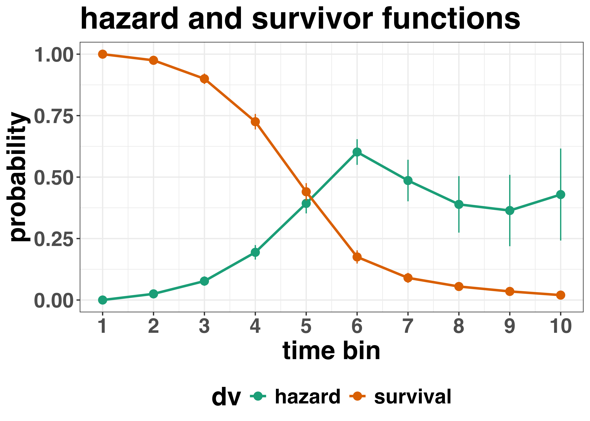

```{r setup, include = FALSE}
pkg1 <- c("papaja", "citr", "tidyverse", "RColorBrewer", "patchwork")

lapply(pkg1, library, character.only = TRUE)


pkg2 <- c("cmdstanr", "standist", "tidyverse", "RColorBrewer", "patchwork", 
         "brms", "tidybayes", "bayesplot", "future", "parallel")

lapply(pkg2, library, character.only = TRUE)

options(brms.backend = "cmdstanr",
        mc.cores = parallel::detectCores(),
        future.fork.enable = TRUE,
        future.rng.onMisuse = "ignore") ## automatically set in RStudio

supportsMulticore()
detectCores()


pkg3 <- c("lme4", "nlme")

lapply(pkg3, library, character.only = TRUE)

# R references
r_refs(file = "r-references.bib", append=F) # append=F prevents multiple copies of the same citation
my_r_citation <- cite_r(file = "r-references.bib", footnote = TRUE) 
```

```{r analysis-preferences}
# Seed for random number generation
set.seed(42)
knitr::opts_chunk$set(cache.extra = knitr::rand_seed)
```

```{r global-chunk-settings}
## set the figure options
knitr::opts_chunk$set(fig.pos='H', out.extra = '', out.height = "67%",
                      fig.align = "center") 
```

# 1. Introduction

## 1.1 Motivation and background context: Comparing means versus distributional shapes 

In experimental psychology, it is standard practice to analyse response times (RTs), saccade latencies, and fixation durations by calculating average performance across a series of trials. Such mean-average comparisons have been the workhorse of experimental psychology over the last century, and have had a substantial impact on theory development as well as our understanding of the structure of cognition and brain function. However, differences in mean RT conceal important pieces of information, such as when an experimental effect starts, how long it lasts, how it evolves with increasing waiting time, and whether its onset is time-locked to other events [@panisHowCanWe2020; @panisNeuropsychologicalEvidenceTemporal2017; @panisStudyingDynamicsVisual2020; @panisTimecourseContingenciesPerceptual2009; @panisWhatShapingRT2016; @panisWhenDoesInhibition2022; @wolkersdorferTemporalDynamicsSequential2020]. Such information is useful not only for the interpretation of experimental effects under investigation, but also for cognitive psychophysiology and computational model selection [@panisAnalyzingResponseTimes2020].

As a simple illustration, Figure 1 shows the results of several simulated RT data sets, which show how mean-average comparisons between two conditions can conceal the shape of the underlying RT distributions. For instance, in examples 1-3, mean RT is always comparable between two conditions, while the distributions differ (Figure 1, left). In contrast, in examples 4-6, mean RT is lower in condition 2 compared to condition 1, but the RT distributions differ in each case (Figure 1, right). Therefore, a comparison of means would lead to a similar conclusion in examples 1-3, as well as examples 4-6, whereas a comparison of the distributions would lead to a different conclusion in every case.

(ref:descr-fig1-caption) Means versus distributional shapes for six different simulated data set examples. The first second after stimulus onset is divided in ten bins of 100 ms. Timebin indicates the bin rank. The first bin is (0,100], the last bin is (900,1000]. For our purposes here, it is enough to know that the distributions plotted represent the probability of an event occurring in that timebin, given that it has not yet occurred. Insets show mean response time per condition.

```{r plot1, fig.cap = "(ref:descr-fig1-caption)", out.width="90%"}
knitr::include_graphics("../sims/figures/haz_inset_facet.jpeg")
```

Why does this matter for research in psychology? Compared to the aggregation of data across trials, a distributional approach offers the possibility to reveal the time course of psychological states. As such, the approach permits different kinds of questions to be asked, different inferences to be made, and it holds the potential to discriminate between different theoretical accounts of psychological and/or brain-based processes.
For example, the distributions in example 4 show that the effect starts between 100 and 200 ms (in timebin 2) and is gone when the waiting time reaches 500 ms or more. In contrast, in example 5, the effect starts around 300 ms and is gone by 700 ms. And in example 6, the effect reverses between 500 and 600 ms. What kind of theory or theories could account for such effects? Are there new auxiliary assumptions that theories need to adopt? And are there new experiments that need to be performed to test the novel predictions that follow from these analyses? As we show later using published examples, for many psychological questions, such "temporal states" information can be theoretically meaningful by leading to more fine-grained understanding of psychological processes, as well as adding a relatively under-used dimension -- the passage of time -- to the theory building toolkit.

From a historical perspective, it is worth noting that the development of analytical tools that can estimate or predict whether and when events will occur is not a new endeavour.
Indeed, hundreds of years ago, analytical methods were developed to predict the duration of time until people died [e.g., @Halley1693; @williammatthewmakehamLawMortalityConstruction1860].
The same logic has been applied to psychological time-to-event data, as previously demonstrated [@panisAnalyzingResponseTimes2020].

## 1.2 Aims and structure of the paper

In this paper, we focus on a distributional method for time-to-event data known as discrete-time Event History Analysis (EHA), a.k.a. survival analysis, hazard analysis, duration analysis, failure-time analysis, and transition analysis [@singerAppliedLongitudinalData2003]. We hope to show the added value of EHA for knowledge and theory building in cognitive psychology and related areas of research, such as cognitive neuroscience. Most importantly, we provide tutorials that provide step-by-step code and instructions in the hope that we can enable others to use EHA in a more routine, efficient and effective manner.

We first provide a brief overview of EHA to orient the reader to the basic concepts that we will use throughout the paper. However, this will remain relatively short, as this has been covered in detail before [@singerAppliedLongitudinalData2003; @allisonDiscreteTimeMethodsAnalysis1982; @allisonSurvivalAnalysisUsing2010]. Indeed, our primary aim here is to introduce the set of tutorials, which explain **how** to do such analyses, rather than repeat in any detail **why** you may do them.  

We provide seven different tutorials, which are written in the R programming language and publicly available on our Github page (https://github.com/sven-panis/    Tutorial_Event_History_Analysis), along with all of the other code and material associated with the project. The tutorials provide hands-on, concrete examples of key parts of the analytical process, so that others can apply EHA to their own time-to-event data. Each tutorial is provided as an RMarkdown file, so that others can download and adapt the code to fit their own purposes. Additionally, each tutorial is made available as a .html file, so that it can be viewed by any web browser, and thus available to those that do not use R. Finally, the manuscript itself is written in R using the papaja package [@pap2024], which makes it computationally reproducible, in terms of the underlying data and figures.

In Tutorial 1a, we illustrate how to process or "wrangle" a previously published RT + accuracy data set to calculate descriptive statistics when there is one independent variable. The descriptive statistics are plotted, and we comment on their interpretation. In Tutorial 1b we provide a generalisation of this approach to illustrate how one can calculate the descriptive statistics when using a more complex design, such as when there are two independent variables. 

In Tutorial 2a, we illustrate how one can fit Bayesian multilevel regression models to RT data using the R package brms. We also perform prior predictive checks, compare models, and interpret the plots of the predicted hazard functions for the selected model, and the posterior distributions of our contrasts of interest. In Tutorial 2b we fit Bayesian multilevel regression models to *timed* accuracy data to perform a micro-level speed-accuracy tradeoff (SAT) analysis, which complements the EHA of RT data for choice RT data. 

In Tutorial 3a, we shortly illustrate how to fit similar multilevel regression models for RT data in a frequentist framework using the R package lme4. We then briefly compare and contrast these inferential frameworks when applied to EHA. In Tutorial 3b, we illustrate how to perform the SAT analysis in a frequentist framework.

In tutorial 4, we illustrate one approach to planning how much data to collect in an experiment using EHA. We use data simulation techniques to vary sample size and trial count per condition until a certain degree of statistical power or precision is reached.

In summary, even though EHA is a widely used statistical tool and there already exist many excellent reviews [e.g., @blossfeldTechniquesEventHistory2002; @hosmerAppliedSurvivalAnalysis2011; @teachmanAnalyzingSocialProcesses1983; @box-steffensmeierEventHistoryModeling2004] and tutorials [e.g., @allisonSurvivalAnalysisUsing2010; @landesIntroductionEventHistory2020] on its general use-cases, we are not aware of any tutorials that are aimed at psychological time-to-event data, and which provide worked examples of the key data processing and multilevel regression modelling steps. 
Therefore, our ultimate goal is twofold: first, we want to convince readers of the many benefits of using EHA when dealing with time-to-event data with a focus on psychological time-to-event data, and second, we want to provide a set of practical tutorials, which provide step-by-step instructions on how you actually perform a discrete-time EHA on time-to-event data such as RT data, as well as a complementary discrete-time SAT analysis on timed accuracy data.

# 2. A brief introduction to event history analysis

We recommend several excellent textbooks for a comprehensive background context to EHA [@singerAppliedLongitudinalData2003; @allisonSurvivalAnalysisUsing2010] and for a more general introduction to understanding regression equations [@gelmanRegressionOtherStories2020; @winterStatisticsLinguistsIntroduction2019]. Our focus here is not on providing a detailed account of the underlying regression equations, since this topic has been comprehensively covered many times before. Instead, we want to provide an intuition regarding how EHA works in general, as well as in the context of experimental psychology. As such, we only supply regression equations in section D of the supplementary material.

## 2.1 Basic features of event history analysis 

To apply EHA, one must be able to:

1. define an event of interest that represents a qualitative change that can be situated in time (e.g., a button press, a saccade onset, a fixation offset, etc.);

2. define time point zero (e.g., target stimulus onset, fixation onset, etc.);

3. measure the passage of time between time point zero and event occurrence in discrete or continuous time units. 

In EHA, the definition of hazard and the type of models employed depend on whether one is using continuous or discrete time units. Since our focus here is on hazard models that use discrete time units, we describe that approach. After dividing time in discrete, contiguous time bins indexed by t (e.g., t = 1:10 timebins), let RT be a discrete random variable denoting the rank of the time bin in which a particular person's response occurs in a particular experimental condition. For example, the first response might occur at 546 ms and it would be in timebin 6 (any RTs from 501 ms to 600 ms). 

Discrete-time EHA focuses on the discrete-time hazard function of event occurrence and the discrete-time survivor function (Figure 2). The equations that define both of these functions are reported in part A of the supplementary material. The discrete-time hazard function gives you, for each time bin, the probability that the event occurs (sometime) in bin t, given that the event does not occur in previous bins. In other words, it reflects the instantaneous likelihood that the event occurs in the current bin, given that it has not yet occurred in the past, i.e., in one of the prior bins. In contrast, the discrete-time survivor function cumulates the bin-by-bin risks of event *non*occurrence to obtain the survival probability, the probability that the event occurs after bin t. In other words, the survivor function gives you for each time bin the likelihood that the event occurs in the future, i.e., in one of the subsequent timebins. 


(ref:descr-plot2-caption) Discrete-time hazard and survivor functions. Discrete time-to-event data were simulated for 200 trials of 1 experimental condition. Error bars represent +/- 1 standard error of the respective proportion. While the hazard function is the vehicle for inferring the time course of cognitive processes, the survival probability S(t-1) can help to qualify or provide context to the interpretation of the hazard probability h(t). For example, the high hazard of .60 = h(t=6) is experienced only by 44 percent of the trials, as S(t=5) = .44. 
Because the survivor function is a decreasing function of time, the error bars in later parts of the hazard function will always be wider and less precise compared to earlier parts.

```{r plot2, fig.cap = "(ref:descr-plot2-caption)", out.width="80%"}

```

## 2.2 Benefits of event history analysis

Statisticians and mathematical psychologists recommend focusing on the hazard function when analyzing time-to-event data for various reasons. We do not cover these benefits in detail here, as these are more general topics that have been covered elsewhere in textbooks. Instead, we briefly list the benefits below, and refer the reader to section F of the supplementary material for more detailed coverage of the benefits. The benefits include:

1. Hazard functions are more diagnostic than density functions when one is interested in studying the detailed shape of a RT distribution (Holden et al., 2009).

2. RT distributions may differ from each other in multiple ways, and hazard functions allow one to capture these differences which mean-average comparisons may conceal (Townsend, 1990).

3. EHA takes account of more of the data collected in a typical speeded response experiment, by virtue of not discarding right-censored observations. Trials with very long RTs are not discarded, but instead contribute to the risk set in each time bin (see section 4.1.2 below).

4. Hazard modeling allows one to incorporate time-varying explanatory covariates, such as heart rate, electroencephalogram (EEG) signal amplitude, gaze location, etc. [@allisonSurvivalAnalysisUsing2010]. This is useful for linking physiological effects to behavioral effects when performing cognitive psychophysiology [@meyerModernMentalChronometry1988].

5. EHA can help to solve the problem of model mimicry, i.e., the fact that different computational models can often predict the same mean RTs as observed in the empirical data, but not necessarily the detailed shapes of the empirical RT hazard distributions. As such, EHA can be a tool to help distinguish between competing theories of cognition and brain function. 

## 2.3 Event history analysis in the context of experimental psychology

To make EHA more relevant to researchers studying cognitive psychology and cognitive neuroscience, in this section we provide a relevant worked example and consider implications that are relevant to that domain of research.

### 2.3.1 A worked example 

In the context of experimental psychology, it is common for participants to be presented with either a 1-button detection task or a discrimination task. For example, a task may involve choosing between two response options with only one of them being correct. For such two-choice RT data, the discrete-time EHA of the RT data (hazard and survivor functions) can be extended with a discrete-time SAT analysis of the timed accuracy data. Specifically, the hazard function of event occurrence can be extended with the discrete-time conditional accuracy function, which gives you the probability that a response is correct given that it is emitted in time bin t [@kantowitzInterpretationReactionTime2021; @wickelgrenSpeedaccuracyTradeoffInformation1977; @allisonSurvivalAnalysisUsing2010]. We refer to this extended (hazard + conditional accuracy) analysis for choice RT data as EHA/SAT. 

Integrating results between hazard and conditional accuracy functions for choice RT data can be informative for understanding psychological processes. To illustrate, we consider a hypothetical choice RT example that is inspired by real data [@panisWhatShapingRT2016], but simplified to make the main point clearer (Figure 3). In a standard priming paradigm, there is a prime stimulus (e.g., an arrow pointing left or right) followed by a target stimulus (another arrow pointing left or right). The prime can then be congruent or incongruent with the target. 

Figure 3 shows that the early upswing in hazard is equal for both priming conditions (Figure 3, upper panel), and that early emitted responses are always correct in the congruent condition and always incorrect in the incongruent condition (Figure 3, lower panel). These results show that for short waiting times (< bin 6), responses always follow the prime (and not the target, as instructed). During timebin 6 the target-triggered response channel is activated and causes response competition -- ca(6) = .5 -- and a lower hazard probability in the incongruent condition. For waiting times of 600 ms or more, the hazard of response occurrence is lower in incongruent compared to congruent trials, and all responses emitted in these late bins are correct. 

This joint pattern of results is interesting because it can provide meaningfully different conclusions about psychological processes compared to conventional analyses, such as computing mean-average RT and accuracy across trials. Mean-average RT would only represent the overall ability of cognition to overcome interference, on average, across trials. For instance, if mean-average RT was higher in incongruent than congruent trials, one may conclude that cognitive mechanisms that support interference control are working as expected across trials, and are indexed by each recorded response. But such a conclusion is not supported when the effects are explored over a timeline. Instead, the psychological conclusion is much more nuanced and suggests that multiple states start, stop and possibly interact over a particular temporal window.

(ref:descr-plot3-caption) Discrete-time hazard and conditional accuracy functions. Discrete time-to-event and conditional accuracy data were simulated for 1000 trials for each of two priming conditions (congruent and incongruent prime stimuli). Error bars represent +/- 1 standard error of the respective proportion. Bin width equals 100 ms. 

```{r plot3, fig.cap = "(ref:descr-plot3-caption)", out.width="80%"}
knitr::include_graphics("../sims/figures/haz_acc_single.jpeg")
```

Unlocking the temporal states of cognitive processes can be revealing for theory development and the understanding of basic psychological processes. Possibly more importantly, however, is that it simultaneously opens the door to address many new and previously unanswered questions. Do all participants show similar temporal states or are there individual differences? Do such individual differences extend to those individuals that have been diagnosed with some form of psychopathology? How do temporal states relate to brain-based mechanisms that might be studied using other methods from cognitive neuroscience? And how much of theory in cognitive psychology would be in need of revision if mean-average comparisons were supplemented with a temporal states approach?

### 2.3.2 Implications for designing experiments

Performing EHA in experimental psychology has implications for how experiments are designed. Indeed, if trials are categorised as a function of when responses occur, then each timebin will only include a subset of the total number of trials. For example, let's consider an experiment where each participant performs 2 conditions and there are 100 trial repetitions per condition. Those 100 trials must be distributed in some manner across the chosen number of bins.

In such experimental designs, since the number of trials per condition are spread across bins, it is important to have a relatively large number of trial repetitions per participant and per condition. Accordingly, experimental designs using this approach typically focus on factorial, within-subject designs, in which a large number of observations are made on a relatively small number of participants (so-called small-*N* designs). This approach emphasizes the precision and reproducibility of data patterns at the individual participant level to increase the inferential validity of the design [@bakerPowerContoursOptimising2021; @smithSmallBeautifulDefense2018]. 

In contrast to the large-*N* design that typically average across many participants without being able to scrutinize individual data patterns,  small-*N*  designs  retain  crucial  information  about  the  data  patterns of individual observers. This can be advantageous whenever participants differ systematically in their strategies or in the time courses of their effects, so that averaging them would lead to misleading data patterns. Note that because statistical power derives both from the number of participants and from the number of repeated measures per participant and condition, small-*N* designs can still achieve what are generally considered acceptable levels of statistical power, if they have a sufficient amount of data overall [@bakerPowerContoursOptimising2021; @smithSmallBeautifulDefense2018].

# 3. An overview of the general analytical workflow

Although the focus is on EHA/SAT, we also want to briefly comment on broader aspects of our general analytical workflow, which relate more to data science and data analysis workflows.

## 3.1 Data science workflow and descriptive statistics

We perform data wrangling following tidyverse principles and a functional programming approach [@wickhamDataScienceImport2023].
In short, functional programming means that you avoid writing your own loops and instead use functions that have been built and tested by others.
In addition, we also supply a set of custom-built functions, which make the process of data wrangling in the context of data preparation and descriptive statistics a lot quicker and more efficient.

## 3.2 Inferential statistical approach 

Our lab adopts an estimation approach to multilevel regression [@kruschkeBayesianNewStatistics2018; @winterStatisticsLinguistsIntroduction2019], which is heavily influenced by the Bayesian framework as suggested by Richard McElreath [@mcelreathStatisticalRethinkingBayesian2020; @kurzStatisticalRethinkingSecondEd2023]. We also use a "keep it maximal" approach to specifying varying (or random) effects [@barrRandomEffectsStructure2013]. This means that wherever possible we include varying intercepts and slopes per participant.
To make inferences, we use two main approaches. We compare models of different complexity, using information criteria (e.g., WAIC) and cross-validation (e.g., LOO), to evaluate out-of-sample predictive accuracy [@mcelreathStatisticalRethinkingBayesian2020]. We also take the most complex model and evaluate key parameters of interest using point and interval estimates.  

## 3.3 Implementation

We used `r my_r_citation$r` for all reported analyses. The content of the tutorials, in terms of EHA and multilevel regression modelling, is mainly based on @allisonSurvivalAnalysisUsing2010, @singerAppliedLongitudinalData2003, @mcelreathStatisticalRethinkingBayesian2020, @heiss2021,  @kurzAppliedLongitudinalDataAnalysis2023, and @kurzStatisticalRethinkingSecondEd2023.

`r my_r_citation$pkgs` <!-- create footnote -->

# 4. Tutorials

Tutorials 1a and 1b show how to calculate and plot the descriptive statistics of EHA/SAT when there are one or two independent variables, respectively. Tutorials 2a and 2b illustrate how to use Bayesian multilevel modeling to fit hazard and conditional accuracy models, respectively. Tutorials 3a and 3b show how to implement, respectively, multilevel models for hazard and conditional accuracy in the frequentist framework.
Additionally, to further simplify the process for other users, the first two tutorials rely on a set of our own custom functions that make sub-processes easier to automate, such as data wrangling and plotting functions (see section B in the supplemental material for a list of the custom functions).

Our list of tutorials is as follows:

* 1a. Wrangle raw data and calculate descriptive stats for one independent variable
* 1b. Wrangle raw data and calculate descriptive stats for two independent variables
* 2a. Bayesian multilevel modeling for h(t)
* 2b. Bayesian multilevel modeling for ca(t)
* 3a. Frequentist multilevel modeling for h(t)
* 3b. Frequentist multilevel modeling for ca(t)
* 4.  Simulation and power analysis for planning experiments

## 4.1 Tutorial 1a: Calculating descriptive statistics using a life table

### 4.1.1 Data wrangling aims 

Our data wrangling procedures serve two related purposes. First, we want to summarise and visualise descriptive statistics that relate to our main research questions about the time course of psychological processes, using a life table. A life table includes for each time bin, the risk set (i.e., the number of trials that are event-free at the start of the bin), the number of observed events, and the estimates of h(t), S(t), P(t), possibly ca(t), and their estimated standard errors (se). 

Second, we want to produce two different data sets that can each be submitted to different types of inferential modelling approaches. The two types of data structure we label as 'person-trial' data and 'person-trial-bin' data. The 'person-trial' data (Table 1) will be familiar to most researchers who record behavioural responses from participants, as it represents the measured RT and accuracy per trial within an experiment. This data set is used when fitting conditional accuracy models (Tutorials 2b and 3b). 

```{r}
## make it reproducible
set.seed(123)

## create the ca data
ca <- tibble(
  pid = as.integer(rep(1, times=10)),
  trial = 1:10,
  condition = sample(rep(c("congruent", "incongruent"), each = 5)),
  rt = rnorm(10, 500, 100),
  accuracy = rbinom(10,1,0.7)
)

## create the ha data
ha <- tibble(
  pid = c(rep(1, times=9)),
  trial = c(rep(1, times=4), rep(2,times=5)),
  condition = c(rep("congruent", times=4), rep("incongruent", times=5)),
  timebin = c(seq(1,4), seq(1,5)),
  event = c(0, 0, 0, 1, 0, 0, 0, 0, 1)
) %>% 
  mutate_if(is.numeric, as.integer)
```

(ref:ca-data-table-caption) Data structure for 'person-trial' data

(ref:ca-data-note-caption) The first 10 trials for participant 1 are shown. These data are simulated and for illustrative purposes only.

```{r ca-data-table}
apa_table(
  ca,
  caption = "(ref:ca-data-table-caption)",
  note = "(ref:ca-data-note-caption)",
  placement = "H"
)
```

In contrast, the 'person-trial-bin' data (Table 2) has a different, more extended structure, which indicates in which bin a response occurred, if at all, in each trial. Therefore, the 'person-trial-bin' data generates a 0 in each bin until an event occurs and then it generates a 1 to signal an event has occurred in that bin. This data set is used when fitting hazard models (Tutorials 2a and 3a). It is worth pointing out that there is no requirement for an event to occur at all (in any bin), as maybe there was no response on that trial or the event occurred after the time window of interest. Likewise, when the event occurs in bin 1 there would only be one row of data for that trial in the person-trial-bin data set.

(ref:ha-data-table-caption) Data structure for 'person-trial-bin' data

(ref:ha-data-note-caption) The first 2 trials for participant 1 from Table 1 are shown. The width of the time bins is 100 ms. These data are simulated and for illustrative purposes only.

```{r ha-data-table}
apa_table(
  ha,
  caption = "(ref:ha-data-table-caption)",
  note = "(ref:ha-data-note-caption)",
  placement = "H"
)
```

### 4.1.2 A real data wrangling example 

To illustrate how to quickly set up life tables for calculating the descriptive statistics (functions of discrete time), we use a published data set on masked response priming from @panisWhatShapingRT2016. 
In their first experiment, @panisWhatShapingRT2016 presented a double arrow for 94 ms that pointed left or right as the target stimulus with an onset at time point zero in each trial. Participants had to indicate the direction in which the double arrow pointed using their corresponding index finger, within 800 ms after target onset. Response time and accuracy were recorded on each trial. Prime type (blank, congruent, incongruent) and mask type were manipulated. Here we focus on the subset of trials in which no mask was presented. The 13-ms prime stimulus was a double arrow presented 187 ms before target onset in the congruent (same direction as target) and incongruent (opposite direction as target) prime conditions.

There are several data wrangling steps to be taken. First, we need to load the data before we (a) supply required column names, and (b) specify the factor condition with the correct levels and labels.

The required column names are as follows:

* "pid", indicating unique participant IDs;
* "trial", indicating each unique trial per participant;
* "condition", a factor indicating the levels of the independent variable (1, 2, ...) and the corresponding labels;
* "rt", indicating the response times in ms;
* "acc", indicating the accuracies (1/0).

In the code of Tutorial 1a, this is accomplished as follows.

\footnotesize
```{r setup-data-tut1, echo=TRUE}
data_wr<-read_csv("../Tutorial_1_descriptive_stats/data/DataExp1_6subjects_wrangled.csv")
colnames(data_wr) <- c("pid","bl","tr","condition","resp","acc","rt","trial") 
data_wr <- data_wr %>% 
  mutate(condition = condition + 1, # original levels were 0, 1, 2.
         condition = factor(condition, 
                            levels=c(1,2,3), 
                            labels=c("blank","congruent","incongruent")))
```
\normalsize

Next, we can set up the life tables and plots of the discrete-time functions h(t), S(t), ca(t), and P(t) -- see section A of the supplementary material for their definitions. To do so using a functional programming approach, one has to nest the data within participants using the group_nest() function, and supply a user-defined censoring time and bin width to our custom function "censor()", as follows.

\footnotesize
```{r nest-apply-functions-tut1, echo = TRUE, eval=F}
data_nested <- data_wr %>% group_nest(pid)
data_final <- data_nested %>% 
  # ! user input: censoring time, and bin width
  mutate(censored = map(data, censor, 600, 40)) %>%   
  # create person-trial-bin data set
  mutate(ptb_data = map(censored, ptb)) %>%          
  # create life tables without ca(t)
  mutate(lifetable = map(ptb_data, setup_lt)) %>%   
  # calculate ca(t)
  mutate(condacc = map(censored, calc_ca)) %>%      
  # create life tables with ca(t)
  mutate(lifetable_ca = map2(lifetable, condacc, join_lt_ca)) %>%    
  # create plots 
  mutate(plot = map2(.x = lifetable_ca, .y = pid, plot_eha,1))  
```
\normalsize

Note that the censoring time should be a multiple of the bin width (both in ms). The censoring time should be a time point after which no informative responses are expected anymore. In experiments that implement a response deadline in each trial the censoring time can equal that deadline time point. Trials with a RT larger than the censoring time, or trials in which no response is emitted during the data collection period, are treated as right-censored observations in EHA. In other words, these trials are not discarded, because they contain the information that the event did not occur before the censoring time. Removing such trials before calculating the mean event time will result in underestimation of the true mean. 

The person-trial-bin oriented data set is created by our custom function ptb(), and it has one row for each time bin (of each trial) that is at risk for event occurrence. The variable "event" in the person-trial-bin oriented data set indicates whether a response occurs (1) or not (0) for each bin.

The next step is to set up the life table using our custom function setup_lt(), calculate the conditional accuracies using our custom function calc_ca(), add the ca(t) estimates to the life table using our custom function join_lt_ca(), and then plot the descriptive statistics using our custom function plot_eha(). When creating the plots, some warning messages will likely be generated, like these:

* Removed 2 rows containing missing values or values outside the scale range (`geom_line()`). 
* Removed 2 rows containing missing values or values outside the scale range (`geom_point()`). 
* Removed 2 rows containing missing values or values outside the scale range (`geom_segment()`).

The warning messages are generated because some bins have no hazard and ca(t) estimates, and no error bars. They can thus safely be ignored.
One can now inspect different aspects, including the life table for a particular condition of a particular subject, and a plot of the different functions for a particular participant. 
In general, it is important to visually inspect the functions first for each participant, in order to identify individuals that may be guessing (e.g., a flat conditional accuracy function at .5 indicates that someone is just guessing), outlying individuals, and/or different groups with qualitatively different behavior. 

Table 3 shows the life table for condition "blank" (no prime stimulus presented) for participant 6.

(ref:life-table-caption) The life table for the blank prime condition of participant 6.

(ref:life-note-caption) The column named "bin" indicates the endpoint of each time bin (in ms), and includes time point zero. For example the first bin is (0,40] with the starting point excluded and the endpoint included. At time point zero, no events can occur and therefore h(t=0) and ca(t=0) are undefined. se = standard error. ca = conditional accuracy. NA = undefined.

```{r life-table}
life_tab <- read_csv("../Tutorial_1_descriptive_stats/tables/lifetable_neutral_s6.csv")

apa_table(
  life_tab,
  caption = "(ref:life-table-caption)",
  note = "(ref:life-note-caption)",
  placement = "H",
  format.args = list(
    digits = c(0,0,0,2,2,2,2,2,2),
    decimal.mark = ".", big.mark = "")
)
```

Figure 4 displays the discrete-time hazard, survivor, conditional accuracy, and probability mass functions for each prime condition for participant 6. By using discrete-time hazard functions of event occurrence -- in combination with conditional accuracy functions for two-choice tasks -- one can provide an unbiased, time-varying, and probabilistic description of the latency and accuracy of responses based on all trials of any data set. 

(ref:descr-plot4-caption) Estimated discrete-time hazard (h), survivor (S), conditional accuracy (ca) and probability mass (P) functions for participant 6. Vertical dotted lines indicate the estimated median RTs. Error bars represent +/- 1 standard error of the respective proportion.

```{r eha-plot, fig.cap = "(ref:descr-plot4-caption)"}
knitr::include_graphics("../Tutorial_1_descriptive_stats/figures/Plot_for_subject6_PanisSchmidt.png")
```

```{r load-data}
load("../Tutorial_1_descriptive_stats/data/descr_stats_tut1a.Rdata") # loads data_final
```

For example, for participant 6, the estimated hazard values in bin (240,280] are `r data_final[[7]][[6]] %>% filter(condition=="blank") %>% select(hazard) %>% slice(7) %>% pull()`, `r data_final[[7]][[6]] %>% filter(condition=="congruent") %>% select(hazard) %>% slice(7) %>% pull()`, and `r data_final[[7]][[6]] %>% filter(condition=="incongruent") %>% select(hazard) %>% slice(7) %>% pull()` for the blank, congruent, and incongruent prime conditions, respectively. In other words, when the waiting time has increased until *240 ms* after target onset, then the conditional probability of response occurrence in the next 40 ms is more than five times larger for both prime-present conditions, compared to the blank prime condition. 

Furthermore, the estimated conditional accuracy values in bin (240,280] are `r data_final[[7]][[6]] %>% filter(condition=="blank") %>% select(ca) %>% slice(7) %>% pull()`, `r data_final[[7]][[6]] %>% filter(condition=="congruent") %>% select(ca) %>% slice(7) %>% pull()`, and `r data_final[[7]][[6]] %>% filter(condition=="incongruent") %>% select(ca) %>% slice(7) %>% pull()` for the blank, congruent, and incongruent prime conditions, respectively. In other words, if a response is emitted in bin (240,280], then the probability that it is correct is estimated to be `r data_final[[7]][[6]] %>% filter(condition=="blank") %>% select(ca) %>% slice(7) %>% pull()`, `r data_final[[7]][[6]] %>% filter(condition=="congruent") %>% select(ca) %>% slice(7) %>% pull()`, and `r data_final[[7]][[6]] %>% filter(condition=="incongruent") %>% select(ca) %>% slice(7) %>% pull()` for the blank, congruent, and incongruent prime conditions, respectively.

However, when the waiting time has increased until *400 ms* after target onset, then the conditional probability of response occurrence in the next 40 ms is estimated to be `r data_final[[7]][[6]] %>% filter(condition=="blank") %>% select(hazard) %>% slice(11) %>% pull()`, `r data_final[[7]][[6]] %>% filter(condition=="congruent") %>% select(hazard) %>% slice(11) %>% pull()`, and `r data_final[[7]][[6]] %>% filter(condition=="incongruent") %>% select(hazard) %>% slice(11) %>% pull()` for the blank, congruent, and incongruent prime conditions, respectively. And when a response does occur in bin (400,440], then the probability that it is correct is estimated to be `r data_final[[7]][[6]] %>% filter(condition=="blank") %>% select(ca) %>% slice(11) %>% pull()`, `r data_final[[7]][[6]] %>% filter(condition=="congruent") %>% select(ca) %>% slice(11) %>% pull()`, and `r data_final[[7]][[6]] %>% filter(condition=="incongruent") %>% select(ca) %>% slice(11) %>% pull()` for the blank, congruent, and incongruent prime conditions, respectively. 
 
These distributional results suggest that participant 6 is initially responding to the prime even though (s)he was instructed to only respond to the target, that response competition emerges in the incongruent prime condition around 300 ms, and that only slower responses are fully controlled by the target stimulus. Qualitatively similar results were obtained for the other five participants. When participants show qualitatively similar distributional patterns, one might consider aggregating their data and plotting the group-average distribution per condition (see Tutorial_1a.Rmd).
  
In general, these results go against the (often implicit) assumption in research on priming that all observed responses are primed responses to the target stimulus. Instead, the distributional data show that early responses are triggered exclusively by the prime stimulus, while only later responses reflect primed responses to the target stimulus.
  
At this point, we have calculated, summarised and plotted descriptive statistics for the key variables in EHA/SAT. As we will show in later Tutorials, statistical models for h(t) and ca(t) can be implemented as generalized linear mixed regression models predicting event occurrence (1/0) and conditional accuracy (1/0) in each bin of a selected time window for analysis. But first we consider calculating the descriptive statistics for two independent variables. 

## 4.2 Tutorial 1b: Generalising to a more complex design

So far in this paper, we have used a simple experimental design, which involved one condition with three levels. But psychological experiments are often more complex, with crossed factorial designs and/or conditions with more than three levels. The purpose of Tutorial 1b, therefore, is to provide a generalisation of the basic approach, which extends to a more complicated design. We felt that this might be useful for researchers in experimental psychology that typically use crossed factorial designs.

To this end, Tutorial 1b illustrates how to calculate and plot the descriptive statistics for the full data set of Experiment 1 of @panisWhatShapingRT2016, which includes two independent variables: mask type and prime type. As we use the same functional programming approach as in Tutorial 1a, we simply present the sample-based functions for each participant as part of Tutorial_1b.Rmd for those that are interested.

## 4.3 Tutorial 2a: Fitting Bayesian hazard models to discrete time-to-event data

In this third tutorial, we illustrate how to fit Bayesian multilevel regression models to the RT data of the masked response priming data used in Tutorial 1a. Fitting (Bayesian or non-Bayesian) regression models to time-to-event data is important when you want to study how the shape of the hazard function depends on various predictors [@singerAppliedLongitudinalData2003]. 

### 4.3.1 Hazard model considerations 

There are several analytic decisions one has to make when fitting a discrete-time hazard model. First, one has to select an analysis time window, i.e., a contiguous set of bins for which there is enough data for each participant. Second, given that the dependent variable (event occurrence) is binary, one has to select a link function (see section C in the supplementary material). The cloglog link is preferred over the logit link when events can occur in principle at any time point within a bin, which is the case for RT data [@singerAppliedLongitudinalData2003]. Third, one has to choose whether to treat TIME (i.e., the time bin index t) as a categorical or continuous predictor. And when you treat a variable as a categorical predictor, you can choose between reference coding and index coding. With reference coding, one defines the variable as a factor and selects one of the k categories as the reference level. Brm() will then construct k-1 indicator variables (see model M1d in Tutorial_2a.Rmd for an example). With index coding, one constructs an index variable that contains integers that correspond to different categories (see models M0i and M1i below). As explained by @mcelreathStatisticalRethinkingBayesian2020, the advantage of index coding is that the same prior can be assigned to each level of the index variable, so that each category has the same prior uncertainty.

In the case of a large-*N* design without repeated measurements, the parameters of a discrete-time hazard model can be estimated using standard logistic regression software after expanding the typical person-trial data set into a person-trial-bin data set [@allisonSurvivalAnalysisUsing2010]. When there is clustering in the data, as in the case of a small-*N* design with repeated measurements, the parameters of a discrete-time hazard model can be estimated using population-averaged methods (e.g., Generalized Estimating Equations), and Bayesian or frequentist generalized linear mixed models [@allisonSurvivalAnalysisUsing2010]. 

In general, there are three assumptions one can make or relax when adding experimental predictor variables and other covariates: The linearity assumption for continuous predictors (the effect of a 1 unit change is the same anywhere on the scale), the additivity assumption (predictors do not interact), and the proportionality assumption (predictors do not interact with TIME).

In tutorial_2a.Rmd we fit several Bayesian multilevel models (i.e., generalized linear mixed models) that differ in complexity to the person-trial-bin oriented data set that we created in Tutorial 1a. We decided to select the analysis time window (200,600] and the cloglog link. Below, we shortly discuss two of these models. The person-trial-bin data set is prepared as follows.

\footnotesize
```{r wrangle-data, eval=F, echo=T}
# read in the file we saved in tutorial 1a
ptb_data <- read_csv("Tutorial_1_descriptive_stats/data/inputfile_hazard_modeling.csv")

ptb_data <- ptb_data %>% 
# select analysis time range: (200,600] with 10 bins (time bin ranks 6 to 15)
filter(period > 5) %>%
       # define categorical predictor TIME as index variable named timebin
mutate(timebin = factor(period, levels = c(6:15)),
       # factor "condition" using reference coding, with "blank" as the reference level
       condition = factor(condition, labels = c("blank", "congruent","incongruent")),
       # categorical predictor "prime" with index coding
       prime = ifelse(condition=="blank", 1, ifelse(condition=="congruent", 2, 3)),
       prime = factor(prime, levels = c(1,2,3)))
```
\normalsize

### 4.3.2 Prior distributions

To get the posterior distribution of each model parameter given the data, we need to specify prior distributions for the model parameters which reflect our prior beliefs.
In Tutorial_2a.Rmd we perform a few prior predictive checks to make sure our selected prior distributions reflect our prior beliefs [@gelmanBayesianWorkflow2020].

The middle column of Figure 15 in section E of the supplementary material shows six examples of prior distributions for an intercept on the logit and/or cloglog scales. While a normal distribution with relatively large variance is often used as a weakly informative prior for continuous dependent variables, rows A and B in Figure 15 show that specifying such distributions on the logit and cloglog scales actually leads to rather informative distributions on the original probability scale, as most mass is pushed to probabilities of 0 and 1. 

### 4.3.3 Model M0i: A null model with index coding

When you do not want to make assumptions about the shape of the hazard function, or its shape is not smooth but irregular, then you can use a general specification of TIME, i.e., fit one grand intercept per time bin. In this first model, we use a general specification of TIME using index coding, and do not include experimental predictors. We call this model "M0i".

Before we fit model M0i, we select the necessary columns from the data, and specify our priors. In the code of Tutorial 2a, model M0i is specified as follows.

```{r fit-model-M0i, echo=T, eval=F} 
model_M0i <-                    
   brm(data = data_M0i,
       family = bernoulli(link="cloglog"),
       formula = event ~ 0 + timebin + (0 + timebin | pid),
       prior = priors_M0i,
       chains = 4, cores = 4, 
       iter = 3000, warmup = 1000,
       control = list(adapt_delta = 0.999, 
                      step_size = 0.04, 
                      max_treedepth = 12),
       seed = 12, init = "0",
       file = "Tutorial_2_Bayesian/models/model_M0i")
```

After selecting the bernoulli family and the cloglog link, the model formula is specified. The specification "0 + ..." removes the default intercept in brm(). The fixed effects include an intercept for each level of timebin. Each of these intercepts is allowed to vary across individuals (variable pid). We request 2000 samples from the posterior distribution for each of four chains. Estimating model M0i took about 30 minutes on a MacBook Pro (Sonoma 14.6.1 OS, 18GB Memory, M3 Pro Chip).

### 4.3.4 Model M1i: Adding the effects of prime-target congruency

Previous research has shown that psychological effects typically change over time [@panisHowCanWe2020; @panisNeuropsychologicalEvidenceTemporal2017; @panisStudyingDynamicsVisual2020; @panisTimecourseContingenciesPerceptual2009; @panisWhenDoesInhibition2022]. In the next model, therefore, we use index coding for both TIME (variable "timebin") and the categorical predictor prime-target-congruency (variable "prime"), so that we get 30 grand intercepts, one for each combination of timebin level and prime level. Here is the model formula of this model that we call "M1i".

```{r fit-model-M1i, eval=F, echo=T}
event ~ 0 + timebin:prime + (0 + timebin:prime | pid)
```

Estimating model M1i took about 124 minutes.

### 4.3.5 Compare the models.

We can compare the two models using the Widely Applicable Information Criterion (WAIC) and Leave-One-Out (LOO) cross-validation, and look at model weights for both criteria [@mcelreathStatisticalRethinkingBayesian2020; @kurzAppliedLongitudinalDataAnalysis2023].

```{r load-models, echo=F, eval=T, echo=F} 
model_M0i <- readRDS("../Tutorial_2_Bayesian/models/model_M0i.rds") 
model_M1i <- readRDS("../Tutorial_2_Bayesian/models/model_M1i.rds") 
#model_M1d <- readRDS("../Tutorial_2_Bayesian/models/model_M1d.rds")

model_M0i <- add_criterion(model_M0i, c("loo", "waic"))
model_M1i <- add_criterion(model_M1i, c("loo", "waic"))
#model_M1d <- add_criterion(model_M1d, c("loo", "waic"))
```

\footnotesize
```{r show-weights, echo=T, eval=T}
model_weights(model_M0i, model_M1i, weights = "loo") %>% round(digits = 2)
model_weights(model_M0i, model_M1i, weights = "waic") %>% round(digits = 2) 
```
\normalsize

Clearly, both the loo and waic weighting schemes assign a weight of 1 to model M1i, and a weight of 0 to the other simpler model. 

### 4.3.6 Evaluating parameter estimates in model M1i

To make inferences from the parameter estimates in model M1i, we first plot the densities of the draws from the posterior distributions of its population-level parameters in Figure 5, together with point (median) and interval estimates (80% and 95% credible intervals).

(ref:descr-plot5-caption) Medians and 80/95% credible intervals of the posterior distributions of the population-level parameters of model M1i.

```{r plot-fixed-effects, fig.cap = "(ref:descr-plot5-caption)", out.width='80%'}
knitr::include_graphics("../Tutorial_2_Bayesian/figures/M1i_postdistr.png")
```

Because the parameter estimates are on the cloglog-hazard scale, we can ease our interpretation by plotting the expected value of the posterior predictive distribution -- the predicted hazard values -- for the grand average (Figure 6A), and for each participant in the data set (Figure 6B).


(ref:descr-plot6-caption) Point (median) and 80/95% credible interval summaries of the hazard estimates (expected values of the draws from the posterior predictive distributions) in each time bin for the grand average (A), and for each participant (B).

```{r plot-pred-grand-effects, fig.cap = "(ref:descr-plot6-caption)", out.width='80%'}
knitr::include_graphics("../Tutorial_2_Bayesian/figures/M1i_pred_combined.png")
```

As we are actually interested in the effects of congruent and incongruent primes, relative to the blank prime condition, we can construct two contrasts (congruent-blank, incongruent-blank), and plot the posterior distributions of these contrast effects, both for the grand average (Figure 7A; grand average marginal effect) and for each participant in the data set (Figure 7B; subject-specific average marginal effect). 


(ref:descr-plot7-caption) Point (mean) and 80/95% credible interval summaries of estimated differences in hazard in each time bin for the grand average (A), and for each participant (B).

```{r plot-grand-ame-effects, fig.cap = "(ref:descr-plot7-caption)", out.width='80%'}
knitr::include_graphics("../Tutorial_2_Bayesian/figures/M1i_ame_combined.png")
```

The point estimates and quantile intervals can be reported in a table (see Tutorial_2a.Rmd for details).

#### Example conclusions for M1i

What can we conclude from model M1i about our research question, i.e., the temporal dynamics of the effect of prime-target congruency on RT? In other words, in which of the 40-ms time bins between 200 and 600 ms after target onset does changing the prime from blank to congruent or incongruent affect the hazard of response occurrence (for a prime-target SOA of 187 ms)?

If we want to estimate the population-level effect of prime type on hazard, we can base our conclusion on Figure 7A. The contrast "congruent minus blank" was estimated to be 0.09 hazard units in bin (200,240] (95% CrI = [0.02, 0.17]), and 0.14 hazard units in bin (240,280]) (95% CrI = [0.04, 0.25]). For the other bins, the 95% credible interval contained zero.
The contrast "incongruent minus blank" was estimated to be 0.09 hazard units in bin (200,240] (95% CrI = [0.01, 0.21]), -0.19 hazard units in bin (320,360] (95% CrI = [-0.31, -0.06]), -0.27 hazard units in bin (360,400] (95% CrI = [-0.45, -0.04]), and -0.23 hazard units in bin (400,440] (95% CrI = [-0.40, -0.03]). For the other bins, the 95% credible interval contained zero. 

There are thus two phases of performance for the average person between 200 and 600 ms after target onset. In the first phase, the addition of a congruent or incongruent prime stimulus increases the hazard of response occurrence compared to blank prime trials in the time period (200, 240]. In the second phase, only the incongruent prime decreases the hazard of response occurrence compared to blank primes, in the time period (320,440]. The sign of the effect of incongruent primes on the hazard of response occurrrence thus depends on how much waiting time has passed since target onset.

If we want to focus more on inter-individual differences, we can study the subject-specific hazard functions in Figure 7B. Note that three participants (1, 2, and 3) show a negative difference for the contrast "congruent minus incongruent" in bin (360,400] -- subject 2 also in bin (320,360].

Future studies could (a) increase the number of participants to estimate the proportion of "dippers" in the subject population, and/or (b) try to explain why this dip occurs. For example, @panisWhatShapingRT2016 concluded that active, top-down, task-guided response inhibition effects emerge around 360 ms after the onset of the stimulus following the prime (here: the target stimulus). Such a top-down inhibitory effect might exist in our priming data set, because after some time participants will learn that the first stimulus is not the one they have to respond to. To prevent a premature overt response to the prime they thus might gradually increase a global response threshold during the remainder of the experiment, which could result in a lower hazard in congruent trials compared to blank trials, for bins after ~360 ms, and towards the end of the experiment. This effect might be masked for incongruent primes by the response competition effect.

Interestingly, all subjects show a tendency in their mean difference (congruent minus blank) to "dip" around that time (Figure 7B). Therefore, future modeling efforts could incorporate the trial number into the model formula, in order to also study how the effects of prime type on hazard change on the long experiment-wide time scale, next to the short trial-wide time scale. In Tutorial_2a.Rmd we provide a number of model formulae that should get you going.

## 4.4 Tutorial 2b: Fitting Bayesian conditional accuracy models

In this fourth tutorial, we illustrate how to fit a Bayesian multilevel regression model to the timed accuracy data from the masked response priming data used in Tutorial 1a. The general process is similar to Tutorial 2a, except that (a) we use the person-trial data, (b) we use the logit link function, and (c) we change the priors. To keep the tutorial short, we only fit one conditional accuracy model, which was based on model M1i from Tutorial 2a and labelled M1i_ca.

To make inferences from the parameter estimates in model M1i_ca, we first plot the densities of the draws from the posterior distributions of its population-level parameters in Figure 8, together with point (median) and interval estimates (80% and 95% credible intervals).

(ref:descr-plot8-caption) Medians and 80/95% credible intervals of the posterior distributions of the population-level parameters of model M1i_ca. ca = conditional accuracy.

```{r plot-ca-fixed-effects, fig.cap = "(ref:descr-plot8-caption)", out.width='80%'}
knitr::include_graphics("../Tutorial_2_Bayesian/figures/M1i_ca_postdistr.png")
```

Because the parameter estimates are on the logit-ca scale, we can ease our interpretation by plotting the expected value of the posterior predictive distribution -- the predicted conditional accurcies -- for the grand average (Figure 9A), and for each participant in the data set (Figure 9B).

(ref:plot9-caption) Point (median) and 80/95% credible interval summaries of the conditional accuracy estimates (expected values of the draws from the posterior predictive distributions) in each time bin for the grand average (A), and for each participant (B).

```{r plot-pred-grand-effects-ca, fig.cap = "(ref:plot9-caption)", out.width='80%'}
knitr::include_graphics("../Tutorial_2_Bayesian/figures/M1i_ca_pred_combined.png")
```

As we are actually interested in the effects of congruent and incongruent primes, relative to the blank prime condition, we can construct two contrasts (congruent-blank, incongruent-blank), and plot the posterior distributions of these contrast effects for the grand average (Figure 10; grand average marginal effect).

(ref:descr-plot10-caption) Point (mean) and 80/95% credible interval summaries of estimated differences in conditional accuracy in each time bin for the grand average.

```{r plot-ca-grand-ame-effects, fig.cap = "(ref:descr-plot10-caption)", out.width='80%'}
knitr::include_graphics("../Tutorial_2_Bayesian/figures/M1i_ca_grand_AME.png")
```

Based on Figure 10 we see that congruent primes have a positive effect on the conditional accuracy of emitted responses in time bins (200,240], (240,280], and (280,320], relative to the estimates in the baseline condition (blank prime; red dashed lines in Figure 10). 
Incongruent primes have a negative effect on the conditional accuracy of emitted responses in those time bins, relative to the estimates in the baseline condition.

## 4.5 Tutorial 3a: Fitting Frequentist hazard models

In this fifth tutorial we illustrate how to fit a multilevel regression model to RT data in the frequentist framework, for the data used in Tutorial 1a. The general process is similar to that in Tutorial 2a, except that there are no priors to set. 

Again, to keep the tutorial concise, we only fit model M1i (see Tutorial 2a) using the function glmer() from the R package lme4. Alternatively, one could also use the function glmmPQL() from the R package MASS [@ripleyMASSSupportFunctions2024]. The resulting hazard model is called M1i_f with the appended "_f" denoting a frequentist model.

In Figure 11 we compare the parameter estimates from the Bayesian regression model M1i with those from the frequentist model M1i_f.

(ref:descr-plot11-caption) Parameter estimates for model M1i from brm() -- means and 95% credible intervals -- and model M1i_f from glmer() -- maximum likelihood estimates and 95% confidence intervals.

```{r plot-comparison, fig.cap = "(ref:descr-plot11-caption)", out.width='80%'}
knitr::include_graphics("../Tutorial_3_Frequentist/comparison.png")
```

Figure 11 confirms that the parameter estimates from both Bayesian and frequentist models are pretty similar, which makes sense given the close similarity in model structure. However, model M1i_f did not converge and resulted in a singular fit. This is of course one of the reasons why Bayesian modeling has become so popular in recent years. But the price you pay for being able to fit models with more complex varying effects structures via a Bayesian framework is increased computation time. In other words, as we have noted throughout, some of the Bayesian models in Tutorials 2a took several hours to build.

## 4.6 Tutorial 3b: Fitting Frequentist conditional accuracy models

In this sixth tutorial we illustrate how to fit a multilevel regression model to the timed accuracy data in the frequentist framework, for the data used in Tutorial 1a. To be concise, we only fit effects from model M1i_ca (see Tutorial 2b) using the function glmer() from the R package lme4. Alternatively, one could also use the function glmmPQL() from the R package MASS [@ripleyMASSSupportFunctions2024]. The resulting conditional accuracy model, which we labelled M1i_ca_f, did not converge and resulted in a singular fit. Again, this just highlights some of the difficulties in fitting reasonably complex varying/random effects structures in frequentist workflows.

## 4.7 Tutorial 4: Planning

In the final tutorial, we look at planning a future experiment, which uses EHA.

### 4.7.1 Background

The general approach to planning that we adopt here involves simulating reasonably structured data to help guide what you might be able to expect from your data once you collect it [@gelmanBayesianWorkflow2020].
The basic structure and code follows the examples outlined by Solomon Kurz in his 'power' blog posts (https://solomonkurz.netlify.app/blog/bayesian-power-analysis-part-i/) and Lisa Debruine's R package faux{} (https://debruine.github.io/faux/) as well as the related paper [@debruineUnderstandingMixedEffectsModels2021]. 

### 4.7.2 Basic workflow

The basic workflow is as follows:

1. Fit a regression model to existing data.
2. Use the regression model parameters to simulate new data.
3. Write a function to create 1000s of datasets and vary parameters of interest (e.g., sample size, trial count, effect size).
4. Summarise the simulated data to estimate likely power or precision of the research design options.

Ideally, in the above workflow, we would also fit a model to each dataset and summarise the model output, rather than the raw data. However, when each model takes several hours to build, and we may want to simulate many 1000s of datasets, it can be computationally demanding for desktop machines. So, for ease, here we just use the raw simulated datasets to guide future expectations.

In the below, we only provide a high-level summary of the process and let readers dive into the details within the tutorial should they feel so inclined.

### 4.7.3 Fit a regression model and simulate one dataset

We again use the data from @panisWhatShapingRT2016 to provide a worked example.
We fit an index coding model on a subset of timebins (six timebins in total) and for two prime conditions (congruent and incongruent). We chose to focus on a subsample of the data to ease the computational burden. We also used a full varying effects structure, with the model formula as follows:

```{r sim-model-bi, eval=F, echo=T}
event ~ 0 + timebin:prime + (0 + timebin:prime | pid)
```

We then took parameters from this model and used them to create a single dataset with 200 trials per condition for 10 individual participants. The raw data and the simulated data are plotted in Figure 12 and show quite close correspondence, which is re-assuring. But, this is only one dataset. What we really want to do is simulate many datasets and vary parameters of interest, which is what we turn to in the next section. 

(ref:simdat-plot12-caption) Raw data from @panisWhatShapingRT2016 and simulated data from 10 participants.

```{r simdat, fig.cap = "(ref:simdat-plot12-caption)", out.width='80%'}
knitr::include_graphics("../Tutorial_4_Planning/figures/raw_vs_d1.jpeg")
```

### 4.7.4 Simulate and summarise data across a range of parameter values

Here we use the same data simulation process as used above, but instead of simulating one dataset, we simulate 1000 datasets per variation in parameter values.
Specifically, in Simulation 1, we vary the number of trials per condition (100, 200, and 400), as well as the effect size in bin 6. 
We focus on bin 6 only, in terms of varying the effect size, just to make things simpler and easier to understand.
The effect size observed in bin 6 in this subsample of data was a 79% reduction in hazard value from the congruent prime (0.401 hazard value) to the incongruent prime condition (0.085 hazard value). In other words, a hazard ratio of 0.21 (e.g., 0.085/0.401 = 0.21). 
As a starting point, we chose three effect sizes, which covered a fairly broad range of hazard ratios (0.25, 0.5, 0.75), which correspond to a 75%, 50% and 25% reduction in hazard value as a function of prime condition.

Summary results from Simulation 1 are shown in Figure 13A.
Figure 13A depicts statistical "power" as calculated by the percentage of lower-bound 95% confidence intervals that exclude zero when the difference between prime condition is calculated (congruent - incongruent). 
In other words, what fraction of the simulated datasets generated an effect of prime that excludes the criterion mark of zero.
We are aware that "power" is not part of a Bayesian analytical workflow, but we choose to include it here, as it is familiar to most researchers in experimental psychology.

The results of Simulation 1 show that if we were targeting an effect size similar to the one reported in the original study, then testing 10 participants and collecting 100 trials per condition would be enough to provide over 95% power.
However, we could not be as confident about smaller effects, such as a hazard ratio of 50% or 25%.
From this simulation, we can see that somewhere between an effect size of a 50% and 75% reduction in hazard value, power increases to a range that most researchers would consider acceptable (i.e., >95% power).
To probe this space a little further, we decided to run a second simulation, which varied different parameters.

In Simulation 2, we varied the effect size between a different range of values (0.5, 0.4, 0.3), which correspond to a 50%, 60% and 70% reduction in hazard value as a function of prime condition.
In addition, we varied the number of participants per experiment between 10, 15, and 20 participants.
Given that trial count per condition made little difference to power in Simulation 1, we fixed trial count at 200 trials per condition in Simulation 2.
Summary results from Simulation 2 are shown in Figure 13B.
A summary of these power calculations might be as follows (trial count = 200 per condition in all cases):

- For a 70% reduction (0.3 hazard ratio), N=10 would give nearly 100% power.
- For a 60% reduction (0.4 hazard ratio), N=10 would give nearly 90% power.
- For a 50% reduction (0.5 hazard ratio), N=15 would give over 80% power.

(ref:power-plot13-caption) Statistical power across data Simulation 1 (A) and Simulation 2 (B). Power was calculated as the percentage of lower-bound 95% confidence intervals that exclude zero when the difference between prime condition is calculated (congruent - incongruent). In Simulation 1, the effect size was varied between a 25%, 50% and 75% reduction in hazard value, whereas the trial count was varied between 100, 200 and 400 trials per condition (the number of participants was fixed at N=10). In Simulation 2, the effect size was varied between a 50%, 60% and 70% reduction in hazard value, whereas the number of participants was varied between N=10, 15 and 20 (the number of trials per condition was fixed at 200). The dashed lines represent 80% (red), 90% (black) and 95% (blue) power. Abbreviations: rep_n = the number of trials per experimental condition; subj_n = the number of participants per simulated experiment.

```{r power, fig.cap = "(ref:power-plot13-caption)", out.width='100%'}
knitr::include_graphics("../Tutorial_4_Planning/figures/bin6_power_col.jpeg")
```

### 4.7.5 Planning decisions

Now that we have summarised our simulated data, what planning decisions could we make about a future study?
More concretely, how many trials per condition should we collect and how many participants should we test? 
Like almost always when planning future studies, the answer depends on your objectives, as well as the available resources [@lakensSampleSizeJustification2022]. 
There is no straigtforward and clear-cut answer.
Some considerations might be as follows:

  - How much power or precision are you looking to obtain in this particular study?
  - Are you running multiple studies that have some form of replication built in?
  - What level of resources do you have at your disposal, such as time, money and personnel?
  - How easy or difficult is it to obtain the specific type of sample?

If we were running this kind of study in our lab, what would we do?
We might pick a hazard ratio of 0.4 or 0.5 as a target effect size since this is much smaller than that observed previously [@panisWhatShapingRT2016].
Then we might pick the corresponding combination of trial count per condition (e.g., 200) and participant sample size (e.g., N=10 or N=15) that takes you over the 80% power mark.
If we wanted to maximise power based on these simulations, and we had the time and resources available, then we would test N=20 participants, which would provide >90% power for an effect size of 0.5.

**But**, and this is an important "but", unless there are unavoidable reasons, no matter what planning choices we made based on these data simulations, we would not solely rely on data collected from one single study. 
Instead, we would run a follow-up experiment that replicates and extends the initial result. 
By doing so, we would aim to avoid the Cult of the Isolated Single Study [@nelderStatisticsStatisticalScience1999; @tongStatisticalInferenceEnables2019], and thus reduce the reliance on any one type of planning tool, such as a power analysis. 
Then, we would look for common patterns across two or more experiments, rather than trying to make the case that a single study on its own has sufficient evidential value to hit some criterion mark.

# 5. Discussion

This main motivation for writing this paper is the observation that EHA and SAT analysis remain under-used in psychological research. As a consequence, the field of psychological research is not taking full advantage of the many benefits EHA/SAT provides compared to more conventional analyses. By providing a freely available set of tutorials, which provide step-by-step guidelines and ready-to-use R code, we hope that researchers will feel more comfortable using EHA/SAT in the future. Indeed, we hope that our tutorials may help to overcome a barrier to entry with EHA/SAT, which is that such approaches require more analytical complexity compared to mean-average comparisons. While we have focused here on within-subject, factorial, small-*N* designs, it is important to realize that EHA/SAT can be applied to other designs as well (large-*N* designs with only one measurement per subject, between-subject designs, etc.). As such, the general workflow and associated code can be modified and applied more broadly to other contexts and research questions. In the following, we discuss issues relating to model complexity and interpretability, individual differences, as well as limitations of the approach and future extensions.

## 5.1 What are the main use-cases of EHA for understanding cognition and brain function?

For those researchers, like ourselves, who are primarily interested in understanding human cognitive and brain systems, we consider two broadly-defined, main use-cases of EHA. First, as we hope to have made clear by this point, EHA is one way to investigating a "temporal states" approach to cognitive processes. EHA provides one way to uncover when cognitive states may start and stop, as well as what they may be tied to or interact with. Therefore, if your research questions concern **when** and **for how long** psychological states occur, our EHA tutorials could be useful tools for you to use.

Second, even if you are not primarily interested in studying the temporal states of cognition, EHA could still be a useful tool to consider using, in order to qualify inferences that are being made based on mean-average comparisons. Given that distinctly different inferences can be made from the same data based on whether one computes a mean-average across trials or a RT distribution of events (Figure 1), it may be important for researchers to supplement mean-average comparisons with EHA. One could envisage scenarios where the implicit assumption of an effect manifesting across all of the time bins measured would not be supported by EHA. Therefore, the conclusion of interest would not apply to all responses, but instead it would be restricted to certain aspects of time.

## 5.2 Model complexity versus interpretability

EHA can quickly become very complex when adding more than one time scale, due to the many possible higher-order interactions. 
For example, some of the models discussed in Tutorial 2a, which we did not focus on in the main text, contain two time scales as covariates: the passage of time on the within-trial time scale, and the passage of time on the across-trial (or within-experiment) time scale. However, when trials are presented in blocks, and blocks of trials within sessions, and when the experiment comprises three sessions, then four time scales can be defined (within-trial, within-block, within-session, and within-experiment).
From a theoretical perspective, adding more than one time scale -- and their interactions -- can be important to capture plasticity and other learning effects that may play out on such longer time scales, and that are probably present in each experiment in general.
From a practical perspective, therefore, some choices need to be made to balance the amount of data that is being collected per participant, condition and across the varying timescales. As one example, if there are several timescales of relevance, then it might be prudent for interpretational purposes to limit the number of experimental predictor variables (conditions).
This is of course where planning and data simulation efforts would be important to provide a guide to experimental design choices (see Tutorial 4).

## 5.3 Individual differences

One important issue is that of possible individual differences in the overall location of the distribution, and the time course of psychological effects. For example, when you wait for a response of the participant on each trial, you allow the participant to have control over the trial duration, and some participants might respond only when they are confident that their emitted response will be correct. These issues can be avoided by introducing a (relatively short) response deadline in each trial, e.g., 500 ms for simple detection tasks, 800 ms for more difficult discrimination tasks, or 2 s for tasks requiring extended high-level processing. Because EHA can deal in a straightforward fashion with right-censored observations (i.e., trials without an observed response in the analysis time window), introducing a response deadline is recommended when designing RT experiments. Furthermore, introducing a response deadline and asking participants to respond before the deadline as much as possible, will also lead to individual distributions that overlap in time, which is important when selecting a common analysis time window when fitting hazard and conditional accuracy models.

But even when using a response deadline, participants can differ qualitatively in the effects they display [see @panisHowCanWe2020]. One way to deal with this is to describe and interpret the different patterns. Another way is to run a clustering algorithm on the individual hazard estimates across all bins and conditions. The obtained dendrogram can then be used to identify a (hopefully big) cluster of participants that behave similarly, and to identify a (hopefully small) cluster of participants with different behavioral patterns. One might then exclude the smaller sub-group of participants before fitting a hazard model or consider the possibility that different cognitive processes may be at play during task performance across the different sub-groups.

Another approach to deal with individual differences is Bayesian prevalence [@inceBayesianInferencePopulation2021], which is a from of small-*N* approach (Smith & Little, 2018). This method looks at effects within each individual in the study and asks how likely it would be to see the same result if the experiment was repeated with a new person chosen from the wider population at random. This approach allows one to quantify how typical or uncommon an observed effect is in the population, and the uncertainty around this estimate.

## 5.4 Limitations

Compared to the orthodox method -- comparing mean-averages between conditions -- the most important limitation of multilevel hazard and conditional accuracy modeling is that it might take a long time to estimate the parameters using Bayesian methods or the model might have to be simplified significantly to use frequentist methods.

Another issue is that you need a relatively large number of trials per condition to estimate the hazard function with high temporal resolution, which is required when testing predictions of process models of cognition. Indeed, in general, there is a trade-off between the number of trials per condition and the temporal resolution (i.e., bin width) of the hazard function. Therefore, we recommend researchers to collect as many trials as possible per experimental condition, given the available resources and considering the participant experience (e.g., fatigue and boredom). For instance, if the maximum session length deemed reasonable is between 1 and 2 hours, what is the maximum number of trials per condition that you could reasonably collect? After consideration, it might be worth conducting multiple testing sessions per participant and/or reducing the number of experimental conditions. Finally, there is a user-friendly online tool for calculating statistical power as a function of the number of trials as well as the number of participants, and this might be worth consulting to guide the research design process (Baker et al., 2021).

We did not discuss continuous-time EHA, nor continuous-time SAT analysis. As indicated by @allisonSurvivalAnalysisUsing2010, learning discrete-time EHA methods first will help in learning continuous-time methods. Given that RT is typically treated as a continuous variable, it is possible that continuous-time methods will ultimately prevail. However, they require much more data to estimate the continuous-time hazard (rate) function well. Thus, by trading a bit of temporal resolution for a lower number of trials, discrete-time methods seem ideal for dealing with typical psychological time-to-event data sets for which there are less than ~200 trials per condition per experiment.

## 5.5 Extensions

The hazard models in this tutorial assume that there is one event of interest. For RT data, this button-press event constitutes a single transition between an "idle" state and a "responded" state. However, in certain situations, more than one event of interest might exist. For example, in a medical or health-related context, an individual might transition back and forth between a "healthy" state and a "depressed" state, before being absorbed into a final "death" state. When you have data on the timing of these transitions, one can apply multi-state hazard models, which generalize EHA to transitions between three or more states [@steeleGeneralMultilevelMultistate2004].
Also, the predictor variables in this tutorial are time-invariant, i.e., their value did not change over the course of a trial. Thus, another extension is to include time-varying predictors, i.e., predictors whose value can change across the time bins within a trial [@allisonSurvivalAnalysisUsing2010]. For example, when gaze position is tracked during a visual search trial, the gaze-target distance will vary during a trial when the eyes move around before a manual response is given; shorter gaze-target distances should be associated with a higher hazard of response occurrence. Note that the effect of a time-varying predictor (e.g., an occipital EEG signal) can itself vary over time.  

# 6. Conclusions

Estimating the temporal distributions of RT and accuracy provide a rich source of information on the time course of cognitive processing, which have been largely undervalued in the history of experimental psychology and cognitive neuroscience. We hope that by providing a set of hands-on, step-by-step tutorials, which come with custom-built and freely available code, researchers will feel more comfortable embracing EHA and investigating the temporal profile of cognitive states. On a broader level, we think that wider adoption of such approaches will have a meaningful impact on the inferences drawn from data, as well as the development of theories regarding the structure of cognition.

\newpage

# References

::: {#refs custom-style="Bibliography"}
:::

\newpage

```{r child = "SupplementaryMaterial.Rmd"}
```
